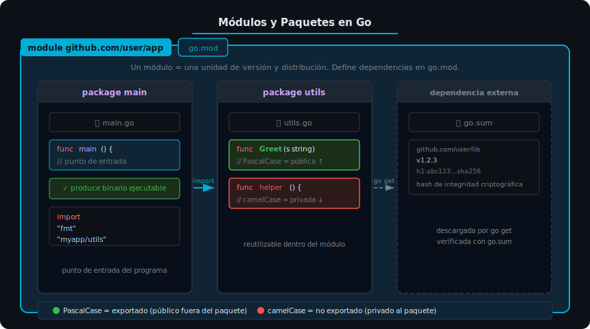

# Módulos, Paquetes y Visibilidad en Go



## 🎯 Objetivos

- Distinguir qué es un **módulo** y qué es un **paquete** en Go
- Crear y gestionar un módulo con `go mod init` y `go mod tidy`
- Aplicar las reglas de **visibilidad** (exportado vs no exportado)
- Organizar un proyecto real en múltiples paquetes

---

## 1. Módulo vs Paquete — la distinción fundamental

En Go estos dos conceptos se confunden al principio, pero son distintos:

| Concepto   | Qué es                                          | Donde vive           |
|------------|-------------------------------------------------|----------------------|
| **Módulo** | Unidad de versión y distribución                | `go.mod` (raíz)      |
| **Paquete**| Unidad de compilación y reutilización de código | Cada directorio `.go`|

```
mi-app/             ← módulo (go.mod vive aquí)
├── go.mod
├── main.go         ← package main
├── utils/
│   └── helpers.go  ← package utils  (paquete independiente)
└── models/
    └── user.go     ← package models (otro paquete independiente)
```

**Qué** → un módulo puede contener muchos paquetes; un paquete pertenece a un único módulo.

**Para qué** → esta separación permite versionar (`v1.2.3`) todo el módulo a la vez,
mientras los paquetes internos se organizan libremente.

**Impacto** → si renombras un directorio, cambia el import path del paquete;
si cambias el nombre del módulo en `go.mod`, se rompen todos los imports del proyecto.

---

## 2. El archivo `go.mod`

`go.mod` es el "contrato" de tu módulo. Se crea con:

```bash
go mod init github.com/usuario/mi-app
```

Estructura mínima:

```go
module github.com/usuario/mi-app  // nombre único del módulo (import path raíz)

go 1.24                           // versión mínima de Go requerida

require (
    github.com/some/lib v1.2.3    // dependencias directas con versión exacta
)
```

**Qué** → `module` declara el import path raíz; todos los paquetes del proyecto
lo usarán como prefijo.

**Para qué** → permite a `go get` y `go mod tidy` resolver de forma reproducible
qué versión exacta de cada dependencia usar.

**Impacto** → `go.mod` + `go.sum` juntos garantizan builds reproducibles:
dos `go build` en máquinas distintas producen el mismo binario.

---

## 3. Visibilidad: exportado vs no exportado

Go tiene una regla de oro para la visibilidad:

> **PascalCase** → exportado (accesible fuera del paquete)
> **camelCase** → no exportado (privado al paquete)

No hay palabras clave `public`, `private` ni `protected`. Solo el nombre decide.

```go
package utils

// Greet está exportada: PascalCase, visible desde otros paquetes.
// Qué     → función pública de la API del paquete.
// Para qué → permite que main u otros paquetes la usen.
// Impacto  → si la renombras a 'greet', se rompen todos los importadores.
func Greet(name string) string {
    return buildMessage(name) // llama a una función interna
}

// buildMessage NO está exportada: camelCase, invisible fuera del paquete.
// Qué     → función de implementación interna.
// Para qué → encapsula detalle que no debe formar parte de la API pública.
// Impacto  → los callers externos no pueden llamarla; es un detalle de implementación.
func buildMessage(name string) string {
    return "Hola, " + name + "!"
}
```

La misma regla aplica a **tipos**, **variables**, **constantes** y **campos de struct**:

```go
type User struct {
    Name  string // exportado  — accesible desde otros paquetes
    email string // no exportado — solo accesible dentro de 'package models'
}
```

---

## 4. Import paths y organización de paquetes

Para importar un paquete interno usamos el import path completo:

```go
package main

import (
    "fmt"                              // stdlib — solo nombre, sin dominio

    "github.com/usuario/mi-app/utils"  // paquete local — módulo + ruta
)

func main() {
    mensaje := utils.Greet("Gopher")  // calificador: nombre del paquete
    fmt.Println(mensaje)
}
```

**Qué** → el calificador (`utils.`) es obligatorio; no existe `using namespace`.

**Para qué** → evita colisiones de nombres y hace explícito el origen de cada símbolo.

**Impacto** → si dos paquetes tienen el mismo nombre, se usa alias:
```go
import (
    utilsA "github.com/a/utils"
    utilsB "github.com/b/utils"
)
```

---

## 5. Comandos esenciales del sistema de módulos

| Comando                      | Qué hace                                              | Cuándo usarlo                    |
|------------------------------|-------------------------------------------------------|----------------------------------|
| `go mod init <module>`       | Crea `go.mod` con el nombre del módulo                | Una vez al crear el proyecto     |
| `go mod tidy`                | Agrega dependencias faltantes, elimina no usadas      | Después de agregar/quitar imports|
| `go get paquete@v1.2.3`      | Descarga e instala una dependencia con versión exacta | Para agregar una nueva librería  |
| `go mod verify`              | Verifica integridad criptográfica con `go.sum`        | Antes de deployar               |
| `go list -m all`             | Lista todas las dependencias (directas e indirectas)  | Para auditar el árbol de deps    |

**Impacto de `go mod tidy`**: si tienes un import en el código pero no en `go.mod`,
la compilación falla. `tidy` sincroniza ambos automáticamente.

---

## 6. `go.sum` y reproducibilidad de builds

Cuando agregas una dependencia, Go genera `go.sum`:

```
github.com/some/lib v1.2.3 h1:XYZ123...sha256hash==
github.com/some/lib v1.2.3/go.mod h1:ABC456...sha256hash==
```

**Qué** → hash SHA-256 del código fuente de cada dependencia.

**Para qué** → garantiza que nadie modificó la dependencia después de que la usaste
por primera vez (protección contra supply-chain attacks).

**Impacto** → siempre versionar `go.sum` en git.
Nunca editarlo manualmente; `go mod tidy` lo mantiene.

---

## ✅ Checklist de verificación

- [ ] ¿Puedes crear un módulo nuevo con `go mod init` y explicar qué hace cada línea de `go.mod`?
- [ ] ¿Puedes distinguir por el nombre de un identificador si está exportado o no?
- [ ] ¿Sabes por qué `go.sum` debe commitearse junto con `go.mod`?
- [ ] ¿Puedes organizar un proyecto con dos paquetes e importar uno desde el otro?
- [ ] ¿Entiendes qué pasa si omites el calificador de paquete al llamar una función importada?

---

## 📚 Recursos adicionales

- [Go Modules Reference](https://go.dev/ref/mod) — documentación oficial del sistema de módulos
- [Effective Go — Package names](https://go.dev/doc/effective_go#package-names) — convenciones de nombres
- [Go by Example — Multiple Return Values](https://gobyexample.com/multiple-return-values)
- [pkg.go.dev — fmt](https://pkg.go.dev/fmt) — referencia del paquete más usado en el bootcamp
