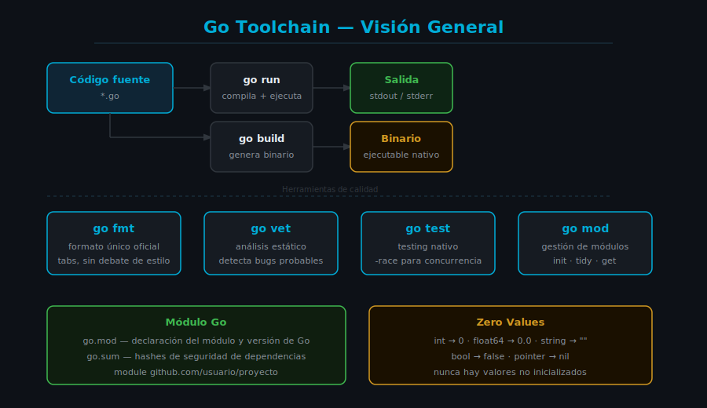

# Introducción a Go: Historia, Filosofía y Toolchain



## 🎯 Objetivos

- Entender por qué existe Go y qué problemas resuelve
- Conocer la filosofía de diseño del lenguaje
- Dominar los comandos esenciales del CLI de Go
- Crear y ejecutar un módulo Go desde cero

---

## 📋 Contenido

### 1. ¿Por qué existe Go?

Go (también llamado Golang) fue creado en 2007 por Robert Griesemer, Rob Pike y Ken Thompson en Google. El equipo buscaba un lenguaje que resolviera problemas reales en sistemas de gran escala:

**Problemas que Go quería resolver:**

- Compilaciones extremadamente lentas en C++ (proyectos que tardaban horas)
- Complejidad excesiva para gestionar dependencias
- Dificultad para escribir código concurrente seguro
- Falta de expresividad sin sacrificar simplicidad

**La filosofía de Go en una frase:**

> "Clear is better than clever." — Go Proverbs

Go eligió conscientemente **no incluir** ciertas características comunes en otros lenguajes:
- ❌ Sin herencia de clases (usa composición)
- ❌ Sin excepciones (usa valores de error explícitos)
- ❌ Sin sobrecarga de operadores
- ❌ Sin macros

Cada exclusión fue una decisión deliberada para mantener el lenguaje simple, legible y predecible.

---

### 2. Características Principales de Go

#### 2.1 Compilación Estática y Rápida

Go compila a binarios nativos **sin dependencias externas**. Un programa Go compilado es un único ejecutable que puedes distribuir directamente.

```go
// Este programa compila en milisegundos y produce un binario de ~2MB
package main

import "fmt"

func main() {
    // fmt.Println imprime en la salida estándar con salto de línea
    fmt.Println("Hola, Go!")
}
```

Para compilar y ejecutar:

```bash
# Compilar y ejecutar directamente (sin generar binario)
go run main.go

# Compilar a binario
go build -o mi-programa main.go

# Ejecutar el binario generado
./mi-programa
```

#### 2.2 Sistema de Tipos Estático con Inferencia

Go es de tipado estático: el compilador conoce el tipo de cada variable en tiempo de compilación. Esto previene errores enteros de categorías.

```go
package main

import "fmt"

func main() {
    // Declaración explícita con tipo
    var nombre string = "Go"

    // Declaración corta con inferencia de tipo (el compilador infiere string)
    version := "1.24"

    // El compilador sabe que ambas son strings
    fmt.Printf("Lenguaje: %s versión %s\n", nombre, version)
}
```

#### 2.3 Concurrencia como Ciudadano de Primera Clase

Go incluye goroutines y channels directamente en el lenguaje, no como una biblioteca externa.

```go
package main

import (
    "fmt"
    "sync"
)

func main() {
    var wg sync.WaitGroup

    // Lanzar 3 goroutines concurrentes
    for i := range 3 {
        wg.Add(1)
        go func(id int) {
            defer wg.Done()
            // Cada goroutine es muy liviana (~2KB de stack inicial)
            fmt.Printf("Goroutine %d ejecutándose\n", id)
        }(i)
    }

    // Esperar a que todas las goroutines terminen
    wg.Wait()
}
```

#### 2.4 Manejo Explícito de Errores

Go no usa excepciones. Los errores son valores que se retornan y se manejan explícitamente. Esto hace que el flujo de control sea predecible y transparente.

```go
package main

import (
    "fmt"
    "os"
)

func main() {
    // os.Open retorna (archivo, error)
    // El error SIEMPRE debe verificarse
    archivo, err := os.Open("datos.txt")
    if err != nil {
        // Manejo explícito: el programa sabe exactamente qué falló
        fmt.Println("No se pudo abrir el archivo:", err)
        return
    }
    defer archivo.Close() // defer garantiza que el archivo se cierre al salir

    fmt.Println("Archivo abierto correctamente:", archivo.Name())
}
```

---

### 3. El Toolchain de Go

Go incluye todas las herramientas necesarias en un único CLI: `go`.

#### 3.1 Comandos Esenciales

```bash
# Ejecutar un programa sin compilar binario
go run main.go
go run .          # ejecutar el paquete del directorio actual

# Compilar a binario
go build          # binario en el directorio actual
go build -o app . # binario con nombre específico

# Formatear código (obligatorio — formato único, sin discusiones de estilo)
go fmt ./...

# Análisis estático de posibles errores
go vet ./...

# Ejecutar tests
go test ./...
go test -v ./...  # modo verbose
go test -race ./... # detectar race conditions

# Gestión de módulos
go mod init github.com/usuario/proyecto  # iniciar módulo
go mod tidy                              # limpiar dependencias no usadas
go get paquete@v1.2.3                   # agregar dependencia

# Documentación
go doc fmt.Println  # ver documentación de un símbolo
go doc os           # ver documentación de un paquete
```

#### 3.2 `go fmt` — El Formateador Oficial

Una de las decisiones más importantes de Go: **existe un único formato oficial**. No hay debates sobre indentación con tabs vs. espacios (Go usa tabs).

```bash
# Formatear todos los archivos Go del proyecto
go fmt ./...
```

Antes del formato:
```go
package main
import "fmt"
func main(){
fmt.Println("sin formato")
}
```

Después de `go fmt`:
```go
package main

import "fmt"

func main() {
	fmt.Println("sin formato")
}
```

#### 3.3 `go vet` — El Analizador Estático

`go vet` detecta errores comunes que el compilador no reporta pero que son probablemente bugs:

```bash
go vet ./...
```

Ejemplo de lo que `go vet` detecta:

```go
package main

import "fmt"

func main() {
    nombre := "Go"
    // ❌ go vet reporta: fmt.Printf format %d has wrong type string
    fmt.Printf("Hola %d\n", nombre)
}
```

---

### 4. Módulos Go (go mod)

Un **módulo** es la unidad de distribución de código en Go. Todo proyecto Go es un módulo.

```bash
# Crear un nuevo módulo
mkdir mi-proyecto
cd mi-proyecto
go mod init github.com/tuusuario/mi-proyecto
```

Esto crea el archivo `go.mod`:

```
module github.com/tuusuario/mi-proyecto

go 1.24
```

#### 4.1 Estructura de un Proyecto Go

```
mi-proyecto/
├── go.mod          # Declaración del módulo y dependencias
├── go.sum          # Hashes de seguridad de dependencias (no editar manualmente)
├── main.go         # Punto de entrada (package main)
└── README.md
```

---

### 5. Estructura de un Programa Go

Todo programa Go ejecutable sigue esta estructura mínima:

```go
// 1. Declaración de paquete — SIEMPRE primera línea
package main

// 2. Importaciones — solo los paquetes que se usan
import (
    "fmt"    // E/S formateada
    "os"     // Sistema operativo
)

// 3. Función main — punto de entrada del programa
func main() {
    // El código comienza aquí
    fmt.Println("¡Bienvenido al Bootcamp de Go!")

    // os.Args contiene los argumentos de línea de comandos
    if len(os.Args) > 1 {
        fmt.Printf("Hola, %s!\n", os.Args[1])
    }
}
```

#### Reglas importantes:

1. **`package main`** — todo ejecutable debe pertenecer al paquete `main`
2. **`func main()`** — punto de entrada, sin parámetros ni retorno
3. **Importaciones no usadas = error de compilación** — Go no permite imports muertos
4. **Variables no usadas = error de compilación** — mismo principio: código limpio obligatorio

---

### 6. Zero Values en Go

Cuando declaras una variable sin asignarle valor, Go le asigna su **zero value** automáticamente. Nunca hay valores no inicializados (no hay `undefined` ni `null` implícito).

```go
package main

import "fmt"

func main() {
    var entero int       // zero value: 0
    var decimal float64  // zero value: 0.0
    var texto string     // zero value: "" (cadena vacía)
    var bandera bool     // zero value: false
    var puntero *int     // zero value: nil

    fmt.Printf("int: %d\n", entero)
    fmt.Printf("float64: %f\n", decimal)
    fmt.Printf("string: %q\n", texto)
    fmt.Printf("bool: %t\n", bandera)
    fmt.Printf("*int: %v\n", puntero)
}
```

---

## 📚 Recursos Adicionales

- [A Tour of Go](https://go.dev/tour) — Tutorial interactivo oficial (empezar aquí)
- [Go Documentation](https://go.dev/doc/) — Documentación oficial
- [Effective Go](https://go.dev/doc/effective_go) — Guía de estilo idiomático
- [Go Playground](https://go.dev/play/) — Ejecutar código Go en el navegador
- [pkg.go.dev](https://pkg.go.dev/std) — Referencia de la librería estándar

---

## ✅ Checklist de Verificación

Antes de continuar a la práctica, verifica que puedas:

- [ ] Ejecutar `go version` y ver Go 1.24+
- [ ] Crear un módulo con `go mod init`
- [ ] Escribir y ejecutar un programa con `go run`
- [ ] Aplicar `go fmt` y `go vet` sin errores
- [ ] Entender la diferencia entre `go run`, `go build` y el binario resultante
- [ ] Explicar qué es un zero value y por qué importa
