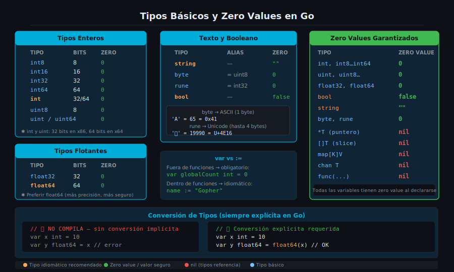

# Tipos Básicos y Zero Values en Go



## 🎯 Objetivos

- Conocer todos los tipos básicos del sistema de tipos de Go
- Entender el concepto de zero value y por qué Go lo garantiza
- Declarar variables con `var` y `:=` en el contexto correcto
- Realizar conversiones de tipo explícitas
- Imprimir variables con los verbos de formato de `fmt`

---

## 📋 Contenido

### 1. El sistema de tipos de Go

Go es un lenguaje de **tipado estático**: cada variable tiene un tipo fijo en tiempo de compilación.
A diferencia de Python o JavaScript, el compilador rechaza código que mezcle tipos sin conversión explícita.

```go
// Qué     → intento de sumar un entero y un flotante sin conversión
// Para qué → demostrar que Go no permite conversiones implícitas
// Impacto  → el compilador falla con "cannot use x (int) as float64"
package main

func main() {
    var x int = 10
    var y float64 = 3.14

    // ❌ Esto NO compila: Go no convierte automáticamente
    // sum := x + y

    // ✅ Conversión explícita obligatoria
    sum := float64(x) + y
    _ = sum
}
```

Esta decisión de diseño es intencional: elimina una categoría entera de bugs sutiles donde
un valor se convierte inesperadamente y produce resultados incorrectos.

---

### 2. Tipos enteros

Go ofrece enteros con y sin signo en múltiples tamaños:

| Tipo | Tamaño | Rango | Zero value |
|------|--------|-------|------------|
| `int8`  | 8 bits  | -128 a 127 | `0` |
| `int16` | 16 bits | -32 768 a 32 767 | `0` |
| `int32` | 32 bits | -2 147 483 648 a 2 147 483 647 | `0` |
| `int64` | 64 bits | -9.2 × 10¹⁸ a 9.2 × 10¹⁸ | `0` |
| `int`   | 32 o 64 bits según plataforma | depende del SO | `0` |
| `uint8`  | 8 bits | 0 a 255 | `0` |
| `uint16` | 16 bits | 0 a 65 535 | `0` |
| `uint32` | 32 bits | 0 a 4 294 967 295 | `0` |
| `uint64` | 64 bits | 0 a 1.8 × 10¹⁹ | `0` |
| `uint`   | 32 o 64 bits | depende del SO | `0` |

**¿Cuál usar?**

```go
// Qué     → regla práctica para elegir tipo entero
// Para qué → evitar elegir un tipo demasiado pequeño o innecesariamente grande
// Impacto  → int es la opción idiomática para índices y contadores generales
package main

import "fmt"

func main() {
    // ✅ Para índices, contadores y valores generales: usar int
    count := 42
    index := 0

    // ✅ Para IDs de base de datos o valores de red: int64
    var userID int64 = 9876543210

    // ✅ Para bytes crudos: uint8 (alias: byte)
    var rawByte uint8 = 255

    fmt.Printf("count=%d, index=%d, userID=%d, rawByte=%d\n",
        count, index, userID, rawByte)
}
```

---

### 3. Tipos de punto flotante

| Tipo | Tamaño | Precisión | Zero value |
|------|--------|-----------|------------|
| `float32` | 32 bits | ~7 dígitos decimales | `0` |
| `float64` | 64 bits | ~15 dígitos decimales | `0` |

```go
// Qué     → declaración de flotantes y precisión disponible
// Para qué → mostrar cuándo importa elegir float32 vs float64
// Impacto  → preferir float64 siempre; float32 solo si el espacio importa (gráficos, ML)
package main

import "fmt"

func main() {
    var pi32 float32 = 3.14159265358979323846
    var pi64 float64 = 3.14159265358979323846

    // float32 pierde precisión después del séptimo dígito
    fmt.Printf("float32: %.20f\n", pi32) // 3.14159274101257324219
    fmt.Printf("float64: %.20f\n", pi64) // 3.14159265358979323846
}
```

---

### 4. Tipo booleano

```go
// Qué     → tipo bool: solo dos valores posibles
// Para qué → representar condiciones, flags, estados binarios
// Impacto  → zero value es false, no 0; no se puede usar 0/1 como bool en Go
package main

import "fmt"

func main() {
    var isActive bool      // zero value: false
    isAdmin := true        // declaración corta con inferencia de tipo

    fmt.Printf("isActive=%v (tipo: %T)\n", isActive, isActive)
    fmt.Printf("isAdmin=%v  (tipo: %T)\n", isAdmin, isAdmin)

    // ❌ Esto NO compila en Go (a diferencia de C o JavaScript):
    // if 1 { ... }
    // if isAdmin == true { ... }  // redundante pero válido
    // ✅ Idiomático:
    if isAdmin {
        fmt.Println("acceso de administrador concedido")
    }
}
```

---

### 5. Tipos de texto: string, byte y rune

Este es uno de los aspectos más importantes del sistema de tipos de Go.

```go
// Qué     → string, byte y rune: tres formas de trabajar con texto
// Para qué → entender cómo Go maneja texto ASCII vs Unicode (UTF-8)
// Impacto  → iterar un string con range da runes, no bytes; crítico para texto no-ASCII
package main

import "fmt"

func main() {
    // string: secuencia inmutable de bytes (no de caracteres)
    greeting := "Hola, 世界" // "Hola, " en ASCII + 世界 en UTF-8 (6 bytes)

    fmt.Printf("string:  %q\n", greeting)
    fmt.Printf("len:     %d bytes\n", len(greeting)) // cuenta bytes, no caracteres

    // byte (alias de uint8): un solo byte
    var b byte = 'A'
    fmt.Printf("byte:    %d (%c)\n", b, b)

    // rune (alias de int32): un punto de código Unicode (un "carácter")
    var r rune = '世'
    fmt.Printf("rune:    %d (%c)\n", r, r)

    // Iterar por bytes (índice + byte):
    fmt.Println("\nBytes:")
    for i := 0; i < len(greeting); i++ {
        fmt.Printf("  [%d] %x\n", i, greeting[i])
    }

    // Iterar por runes (índice + rune): la forma idiomática para texto Unicode
    fmt.Println("\nRunes (range):")
    for i, ch := range greeting {
        fmt.Printf("  [%d] %c (U+%04X)\n", i, ch, ch)
    }
}
```

**Regla práctica:**
- Usa `len(s)` cuando necesites el tamaño en bytes (por ejemplo, para protocolos de red)
- Usa `[]rune(s)` cuando necesites el número de caracteres visibles

---

### 6. Zero Values: la promesa de Go

En Go, **todas las variables declaradas sin inicializar reciben automáticamente su zero value**.
No existe el concepto de "variable no inicializada" que produce comportamiento indefinido (como en C).

```go
// Qué     → zero values de todos los tipos básicos
// Para qué → demostrar que Go garantiza valores seguros por defecto
// Impacto  → elimina una categoría entera de bugs de "garbage value" de C/C++
package main

import "fmt"

func main() {
    var i int        // 0
    var f float64    // 0
    var b bool       // false
    var s string     // "" (cadena vacía)
    var p *int       // nil (puntero nulo)

    fmt.Printf("int:     %v\n", i)
    fmt.Printf("float64: %v\n", f)
    fmt.Printf("bool:    %v\n", b)
    fmt.Printf("string:  %q\n", s)
    fmt.Printf("*int:    %v\n", p)
}
```

| Tipo | Zero value |
|------|------------|
| Todos los enteros | `0` |
| `float32`, `float64` | `0` |
| `bool` | `false` |
| `string` | `""` |
| Punteros, slices, maps, canales, funciones | `nil` |

---

### 7. `var` vs `:=`

```go
// Qué     → dos formas de declarar variables en Go
// Para qué → entender cuándo usar cada una según el contexto
// Impacto  → := solo funciona dentro de funciones; var es obligatorio en scope de paquete
package main

var globalCounter int = 0 // ✅ var obligatorio fuera de funciones

func main() {
    // var: útil cuando el tipo no puede inferirse o se quiere el zero value
    var timeout int
    var message string

    // :=  (declaración corta): idiomática dentro de funciones
    name := "Gopher"
    count := 42
    active := true

    // var con tipo explícito cuando la inferencia daría el tipo incorrecto
    var ratio float64 = 1 / 3 // sin var float64, 1/3 sería división entera = 0

    _ = timeout
    _ = message
    _ = name
    _ = count
    _ = active
    _ = ratio
}
```

**Regla de oro:**
- **Fuera de funciones**: usar `var`
- **Dentro de funciones**: preferir `:=` salvo que necesites el zero value explícito

---

### 8. Verbos de formato `fmt`

| Verbo | Significado | Ejemplo |
|-------|-------------|---------|
| `%v`  | Valor en formato por defecto | `42`, `true`, `hola` |
| `%T`  | Tipo de la variable | `int`, `float64`, `string` |
| `%d`  | Entero decimal | `42` |
| `%f`  | Flotante | `3.140000` |
| `%.2f`| Flotante con 2 decimales | `3.14` |
| `%s`  | String sin comillas | `hola` |
| `%q`  | String con comillas | `"hola"` |
| `%c`  | Carácter (rune) | `A` |
| `%x`  | Hexadecimal | `2a` |
| `%b`  | Binario | `101010` |

---

## ✅ Checklist de Verificación

Antes de pasar a la siguiente sección, verifica que puedes responder:

- [ ] ¿Puedes declarar una variable `float64` usando `:=` y explicar por qué el valor `1/3` necesita atención especial?
- [ ] ¿Cuál es el zero value de `string` y cómo lo verificas con `%q`?
- [ ] ¿Por qué `len("Hola, 世界")` no da el número de caracteres visibles?
- [ ] ¿Cuándo es obligatorio usar `var` en lugar de `:=`?
- [ ] ¿Cómo conviertes un `int` a `float64` en Go?

---

## 📚 Referencias

- [The Go Specification — Types](https://go.dev/ref/spec#Types)
- [pkg.go.dev/fmt — Verbs](https://pkg.go.dev/fmt#hdr-Printing)
- [Go by Example — Variables](https://gobyexample.com/variables)
- [Go by Example — String Formatting](https://gobyexample.com/string-formatting)
