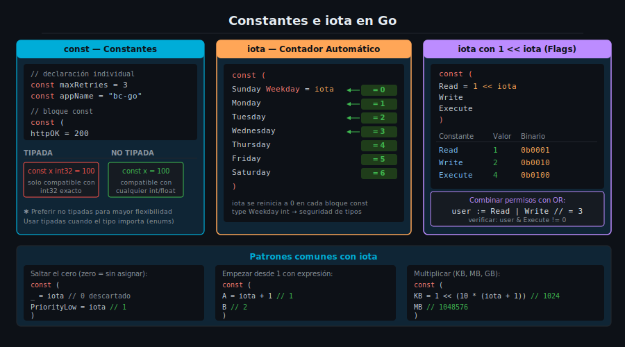

# Constantes e iota en Go



## 🎯 Objetivos

- Declarar constantes con `const` y entender sus diferencias con `var`
- Distinguir entre constantes tipadas y no tipadas
- Usar `iota` para crear enumeraciones legibles y mantenibles
- Aplicar patrones avanzados de `iota` (desplazamiento de bits, saltos)

---

## 📋 Contenido

### 1. ¿Qué es una constante?

Una constante es un valor que el compilador fija en tiempo de compilación y que **nunca cambia** durante la ejecución del programa.

```go
// Qué     → declaración de constantes simples con const
// Para qué → representar valores fijos que no deben mutar nunca
// Impacto  → el compilador puede optimizar constantes incrustándolas en el código;
//            intentar modificarlas produce un error de compilación, no de ejecución
package main

import "fmt"

const maxRetries = 3
const appName = "bc-go"
const version = "1.0.0"

func main() {
    fmt.Printf("%s v%s — reintentos máximos: %d\n", appName, version, maxRetries)

    // ❌ Esto NO compila:
    // maxRetries = 5 // cannot assign to maxRetries (declared const)
}
```

**Constantes vs Variables:**

| Característica | `const` | `var` |
|----------------|---------|-------|
| Valor en compilación | ✅ siempre | ❌ puede ser runtime |
| Mutable | ❌ nunca | ✅ sí |
| Zero value automático | ❌ debe inicializarse | ✅ sí |
| Puede ser una función | ❌ no | ✅ sí |
| Memoria en heap | ❌ incrustada | ✅ puede ocupar |

---

### 2. Constantes tipadas vs no tipadas

Esta es la distinción más sutil pero importante de las constantes en Go.

```go
// Qué     → diferencia entre constantes tipadas y no tipadas
// Para qué → las no tipadas son más flexibles: pueden usarse con cualquier tipo numérico compatible
// Impacto  → una constante tipada solo es compatible con su tipo exacto;
//            una no tipada se adapta al contexto donde se usa
package main

import "fmt"

// Constante tipada: el tipo está fijo
const typedMax int32 = 100

// Constante no tipada: el compilador le asigna un "tipo ideal" flexible
const untypedMax = 100

func main() {
    var a int64 = untypedMax  // ✅ funciona: 100 es compatible con int64
    var b int32 = untypedMax  // ✅ funciona: 100 es compatible con int32

    // ❌ Esto NO compila: typedMax es int32, no int64
    // var c int64 = typedMax

    // ✅ Requiere conversión explícita:
    var c int64 = int64(typedMax)

    fmt.Println(a, b, c)
}
```

**Tipos ideales de constantes no tipadas:**

| Valor literal | Tipo ideal |
|---------------|------------|
| `42` | `int` ideal |
| `3.14` | `float64` ideal |
| `'A'` | `rune` ideal |
| `"hola"` | `string` |
| `true` | `bool` |

---

### 3. Bloques `const`

Cuando necesitas declarar múltiples constantes relacionadas, usa un bloque `const`:

```go
// Qué     → bloque const para agrupar constantes relacionadas
// Para qué → mejor legibilidad y organización del código
// Impacto  → idiomático en Go; señala al lector que estas constantes forman un grupo lógico
package main

import "fmt"

const (
    httpOK        = 200
    httpNotFound  = 404
    httpInternal  = 500

    defaultTimeout = 30
    maxConnections = 100
)

func main() {
    fmt.Printf("HTTP OK: %d\n", httpOK)
    fmt.Printf("Timeout: %d segundos\n", defaultTimeout)
}
```

---

### 4. `iota`: el enumerador de Go

`iota` es un identificador especial que solo existe dentro de bloques `const`.
En cada bloque, `iota` empieza en `0` y se **incrementa automáticamente** en `1` por cada constante.

```go
// Qué     → iota como generador automático de valores en un bloque const
// Para qué → evitar escribir manualmente 0, 1, 2, 3... y el riesgo de errores al insertar valores
// Impacto  → si se inserta una nueva constante en el medio, todos los valores se recalculan
//            automáticamente; con literales manuales habría que actualizar todos los siguientes
package main

import "fmt"

// Tipo personalizado: idiomático para enums en Go
type Weekday int

const (
    Sunday Weekday = iota // 0
    Monday                // 1
    Tuesday               // 2
    Wednesday             // 3
    Thursday              // 4
    Friday                // 5
    Saturday              // 6
)

func main() {
    today := Wednesday
    fmt.Printf("Hoy es el día %d de la semana\n", today) // 3
    fmt.Printf("Tipo: %T\n", today)                       // main.Weekday
}
```

**¿Por qué crear un tipo personalizado (`type Weekday int`)?**

```go
// Qué     → tipo personalizado sobre int para enums
// Para qué → el compilador distingue Weekday de int; no puedes mezclar accidentalmente
// Impacto  → seguridad de tipos en tiempo de compilación: no puedes pasar un int arbitrario
//            donde se espera Weekday sin conversión explícita
package main

func processDay(d Weekday) {
    // ...
}

func main() {
    processDay(Wednesday)  // ✅ correcto
    // processDay(3)        // ❌ no compila: cannot use 3 (untyped int) as Weekday
}
```

---

### 5. `iota` que empieza en 1

A veces `0` no es un valor válido (por ejemplo, si `0` significa "sin asignar"):

```go
// Qué     → iota empezando en 1 con el operador +
// Para qué → reservar el valor 0 como "desconocido" o "no asignado"
// Impacto  → el zero value del tipo (0) puede usarse como centinela de "no inicializado"
package main

import "fmt"

type Priority int

const (
    _               = iota // 0 descartado intencionalmente con _
    PriorityLow     Priority = iota // 1
    PriorityMedium                  // 2
    PriorityHigh                    // 3
    PriorityCritical                // 4
)

func main() {
    var p Priority // zero value: 0 (no asignado)
    fmt.Printf("Sin asignar: %d\n", p)

    p = PriorityHigh
    fmt.Printf("Prioridad alta: %d\n", p) // 3
}
```

---

### 6. `iota` con desplazamiento de bits (flags de permisos)

Este es el patrón más potente de `iota`. Se usa para crear **flags combinables con OR a nivel de bits**:

```go
// Qué     → iota con operador de desplazamiento << para generar potencias de 2
// Para qué → crear permisos que pueden combinarse con el operador |
// Impacto  → permite verificar múltiples permisos con una sola operación AND a nivel de bits;
//            patrón común en sistemas de archivos, networking y configuración de flags
package main

import "fmt"

type Permission uint8

const (
    Read    Permission = 1 << iota // 1 << 0 = 0b00000001 = 1
    Write                          // 1 << 1 = 0b00000010 = 2
    Execute                        // 1 << 2 = 0b00000100 = 4
)

func hasPermission(user, required Permission) bool {
    // AND a nivel de bits: si el resultado no es cero, el usuario tiene el permiso
    return user&required != 0
}

func main() {
    // Un usuario con permisos de lectura y escritura (pero no ejecución)
    user := Read | Write // 0b00000001 | 0b00000010 = 0b00000011 = 3

    fmt.Printf("Puede leer:    %v\n", hasPermission(user, Read))    // true
    fmt.Printf("Puede escribir: %v\n", hasPermission(user, Write))   // true
    fmt.Printf("Puede ejecutar: %v\n", hasPermission(user, Execute)) // false
}
```

**La potencia de este patrón**: con 8 bits (`uint8`) puedes representar 256 combinaciones de 8 permisos distintos. Con un solo entero.

---

### 7. `iota` se reinicia en cada bloque

Un detalle crítico: `iota` empieza en `0` **en cada bloque `const` nuevo**, no de forma global:

```go
// Qué     → iota se reinicia a 0 al inicio de cada bloque const
// Para qué → cada grupo de constantes tiene su propia secuencia independiente
// Impacto  → si defines dos enums distintos, sus valores comienzan desde 0 de forma independiente
package main

import "fmt"

type Color int
const (
    Red Color = iota   // 0
    Green              // 1
    Blue               // 2
)

type Size int
const (
    Small Size = iota  // 0 — iota se reinicia
    Medium             // 1
    Large              // 2
)

func main() {
    fmt.Println(Red, Green, Blue)       // 0 1 2
    fmt.Println(Small, Medium, Large)   // 0 1 2
}
```

---

## ✅ Checklist de Verificación

Antes de pasar a la siguiente sección, verifica que puedes responder:

- [ ] ¿Por qué una constante no tipada es más flexible que una tipada?
- [ ] ¿Qué valor tiene `iota` en la cuarta constante de un bloque `const`?
- [ ] ¿Por qué se recomienda crear un tipo personalizado (`type X int`) para enums con `iota`?
- [ ] ¿Cómo generas las potencias de 2 (1, 2, 4, 8…) con `iota`?
- [ ] Si defines dos bloques `const` en el mismo archivo, ¿comparten el mismo contador de `iota`?

---

## 📚 Referencias

- [The Go Specification — Constant declarations](https://go.dev/ref/spec#Constant_declarations)
- [The Go Specification — iota](https://go.dev/ref/spec#Iota)
- [Go by Example — Constants](https://gobyexample.com/constants)
- [Effective Go — Constants](https://go.dev/doc/effective_go#constants)
