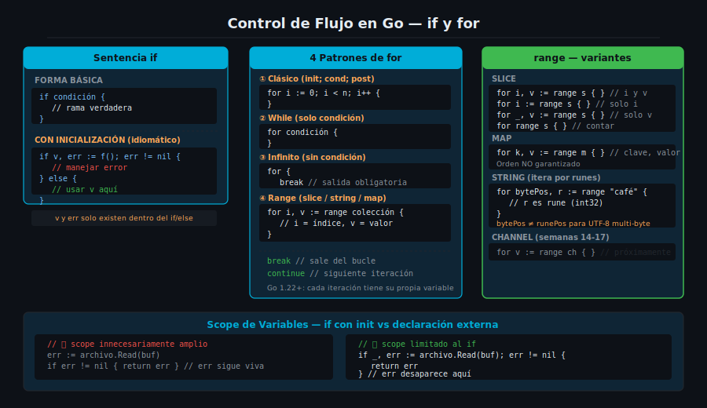

# `if` y `for` en Go



## 🎯 Objetivos

- Escribir condiciones `if` con inicialización de variable para limitar el scope
- Dominar los 4 patrones del bucle `for`: clásico, while, infinito y range
- Usar `break`, `continue` y `for range` sobre strings Unicode correctamente

---

## 1. La sentencia `if`

Go hereda la estructura clásica de `if/else`, pero elimina los paréntesis obligatorios alrededor de la condición. Las llaves `{}` son siempre obligatorias.

```go
// Forma básica — sin paréntesis en la condición
temperatura := 38.5

if temperatura > 37.0 {
    fmt.Println("Fiebre detectada")
} else if temperatura == 37.0 {
    fmt.Println("Temperatura normal alta")
} else {
    fmt.Println("Sin fiebre")
}
```

### `if` con inicialización

Go permite ejecutar una sentencia de inicialización justo antes de evaluar la condición. La variable declarada en esa sentencia **solo existe dentro del bloque `if`/`else`**.

```go
// La variable 'err' solo existe dentro del if/else
if archivo, err := os.Open("datos.txt"); err != nil {
    fmt.Println("Error al abrir:", err)
} else {
    defer archivo.Close()
    fmt.Println("Archivo abierto:", archivo.Name())
}
// 'archivo' y 'err' no son accesibles aquí
```

> Este patrón es idiomático en Go para manejar errores en una sola expresión. Evita contaminar el scope externo con variables temporales.

---

## 2. El único bucle: `for`

Go no tiene `while`, `do...while` ni `foreach`. Todas esas variantes se expresan con `for`. Esto simplifica el lenguaje y unifica el aprendizaje.

### Patrón 1 — `for` clásico (tres componentes)

```go
// init; condición; post
for i := 0; i < 5; i++ {
    fmt.Println(i)  // 0, 1, 2, 3, 4
}
```

### Patrón 2 — `for` como while (solo condición)

Cuando init y post son vacíos, `for` se comporta como `while` de otros lenguajes.

```go
// Solo condición — equivalente a while(activo)
activo := true
contador := 0
for activo {
    contador++
    if contador >= 3 {
        activo = false
    }
}
fmt.Println("Contador final:", contador) // 3
```

---

## 3. `for` infinito y control de flujo

Un `for` sin condición crea un bucle infinito. Se sale de él con `break` o `return`.

```go
// Bucle infinito — requiere break o return para salir
intentos := 0
for {
    intentos++
    if intentos >= 3 {
        break  // sale del bucle
    }
    fmt.Println("Intento:", intentos)
}
```

`continue` salta a la siguiente iteración sin ejecutar el resto del cuerpo:

```go
// Imprimir solo números pares
for i := 0; i < 10; i++ {
    if i%2 != 0 {
        continue  // saltar impares
    }
    fmt.Println(i)  // 0, 2, 4, 6, 8
}
```

---

## 4. `for range` — iteración idiomática

`range` es la forma idiomática de iterar sobre slices, maps, strings y channels. Retorna índice y valor en cada iteración.

```go
frutas := []string{"manzana", "pera", "uva"}

// índice y valor
for i, fruta := range frutas {
    fmt.Printf("[%d] %s\n", i, fruta)
}

// solo índice (valor ignorado con _)
for i := range frutas {
    fmt.Println("Posición:", i)
}

// solo valor
for _, fruta := range frutas {
    fmt.Println(fruta)
}
```

### `range` sobre strings y Unicode

Cuando se usa `range` sobre un `string`, Go itera por **runes** (puntos de código Unicode), no por bytes. Esto es fundamental para manejar texto con caracteres no-ASCII.

```go
// range sobre string — itera por runes, no bytes
palabra := "café"

for posicion, caracter := range palabra {
    fmt.Printf("byte[%d] = %c (rune %d)\n", posicion, caracter, caracter)
}
// byte[0] = c (rune 99)
// byte[1] = a (rune 97)
// byte[2] = f (rune 102)
// byte[3] = é (rune 233)   ← é ocupa 2 bytes en UTF-8, salto de 3→5
```

> Nota: la `posición` es el índice en **bytes**, no en runes. Para `é` (2 bytes UTF-8), el siguiente índice salta de 3 a 5.

---

## 5. Errores comunes con `for`

```go
// ❌ Captura de variable de loop en closure (bug clásico)
funciones := make([]func(), 3)
for i := 0; i < 3; i++ {
    funciones[i] = func() { fmt.Println(i) } // captura la variable i, no su valor
}
// Al ejecutar funciones[0](), funciones[1](), funciones[2]()
// todos imprimen 3 (el valor final de i)

// ✅ Corrección: crear una copia local dentro del bucle
for i := 0; i < 3; i++ {
    i := i  // nueva variable i local al scope del bucle
    funciones[i] = func() { fmt.Println(i) }
}
```

> A partir de Go 1.22, la semántica del `for` cambió: cada iteración tiene su propia copia de la variable de loop. El error anterior ya no ocurre en Go 1.22+. Sin embargo, entender la causa sigue siendo importante para leer código legado.

---

## ✅ Checklist de verificación

- [ ] ¿Puedo escribir un `if` con variable de inicialización y limitar su scope correctamente?
- [ ] ¿Conozco los 4 patrones de `for` y cuándo usar cada uno?
- [ ] ¿Entiendo por qué `range` sobre un string itera por runes, no bytes?
- [ ] ¿Puedo usar `break` y `continue` sin crear bucles infinitos accidentales?
- [ ] ¿Conozco el cambio de semántica de Go 1.22 para variables de loop?

## 📚 Recursos adicionales

- [A Tour of Go — Flow control](https://go.dev/tour/flowcontrol/1)
- [Effective Go — For](https://go.dev/doc/effective_go#for)
- [Go Spec — For statements](https://go.dev/ref/spec#For_statements)
- [Go Blog — Strings, bytes, runes and characters](https://go.dev/blog/strings)
