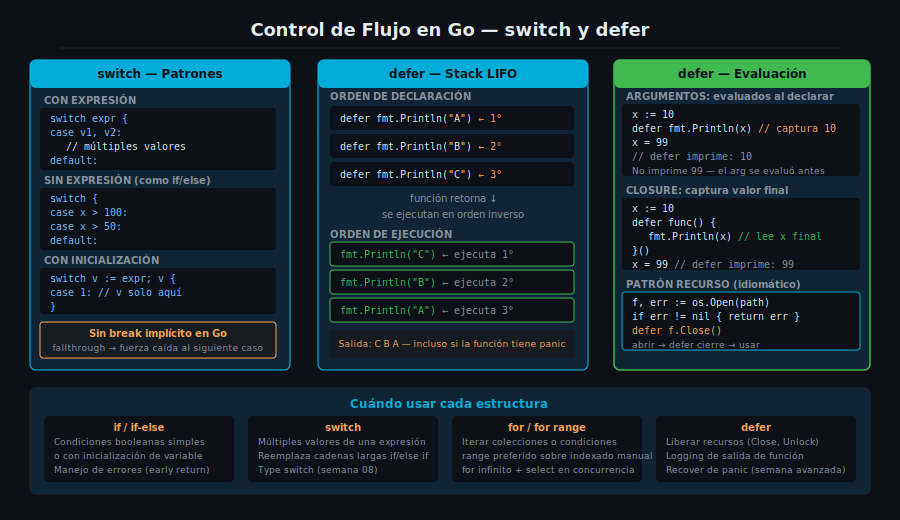

# `switch` y `defer` en Go



## 🎯 Objetivos

- Escribir `switch` con expresión, sin expresión y con múltiples valores por caso
- Entender por qué Go no necesita `break` en `switch` y cuándo usar `fallthrough`
- Explicar el modelo LIFO de `defer` y cuándo se evalúan sus argumentos
- Aplicar `defer` para gestión de recursos de forma idiomática y segura

---

## 1. La sentencia `switch`

`switch` en Go evalúa una expresión y ejecuta la primera rama (`case`) que coincida. A diferencia de C, Java o JavaScript, **no hay fall-through implícito** entre casos — no se necesita `break`.

```go
// switch sobre expresión — sin break necesario
dia := "lunes"

switch dia {
case "lunes", "martes", "miércoles", "jueves", "viernes":
    fmt.Println("Día laboral")
case "sábado", "domingo":
    fmt.Println("Fin de semana")
default:
    fmt.Println("Día desconocido")
}
```

Un `case` puede listar múltiples valores separados por coma — todos activan la misma rama.

### `switch` sin expresión

Cuando se omite la expresión, `switch` evalúa `true` para cada caso. Esto es equivalente a una cadena `if/else if` pero más legible:

```go
// switch sin expresión — equivalente a if/else if
temperatura := 38.5

switch {
case temperatura >= 40.0:
    fmt.Println("Fiebre alta — requiere atención médica")
case temperatura >= 37.5:
    fmt.Println("Fiebre moderada")
case temperatura >= 37.0:
    fmt.Println("Temperatura elevada")
default:
    fmt.Println("Temperatura normal")
}
```

---

## 2. `switch` con inicialización

Al igual que `if`, `switch` admite una sentencia de inicialización antes de la expresión:

```go
// Variable 'hora' limitada al scope del switch
switch hora := time.Now().Hour(); {
case hora < 12:
    fmt.Println("Buenos días")
case hora < 18:
    fmt.Println("Buenas tardes")
default:
    fmt.Println("Buenas noches")
}
// 'hora' no es accesible aquí
```

### `fallthrough` — cuando sí necesitas el fall-through

En los raros casos en que una rama debe continuar ejecutando la siguiente, usa `fallthrough` de forma explícita. El compilador lo deja claro en el código:

```go
// fallthrough — continúa al siguiente caso sin evaluar su condición
nivel := 2

switch nivel {
case 1:
    fmt.Println("Nivel 1")
    fallthrough
case 2:
    fmt.Println("Nivel 2 o inferior")  // se ejecuta si nivel==1 o nivel==2
case 3:
    fmt.Println("Nivel 3")
}
```

> Usa `fallthrough` con moderación. La mayoría de las veces, agrupar valores en un `case` es más claro: `case 1, 2:`.

---

## 3. La sentencia `defer`

`defer` pospone la ejecución de una función hasta que la función que la contiene retorne, **incluso si retorna por pánico o error**. Es el mecanismo principal de Go para garantizar limpieza de recursos.

```go
// defer garantiza que el archivo se cierra sin importar cómo salga la función
func readFile(path string) error {
    f, err := os.Open(path)
    if err != nil {
        return fmt.Errorf("readFile: %w", err)
    }
    defer f.Close()  // se ejecuta cuando readFile() retorne

    // ... leer datos ...
    return nil
}
```

El patrón `abrir → defer cierre → usar` es idiomático y previene resource leaks.

---

## 4. Modelo LIFO de `defer`

Cuando hay múltiples `defer` en una función, se ejecutan en orden **LIFO** (Last In, First Out) — el último en declararse es el primero en ejecutarse. Esto es equivalente a un stack.

```go
// Orden LIFO de defer
func contarHasta() {
    defer fmt.Println("Primero declarado → último en ejecutar: 1")
    defer fmt.Println("Segundo declarado → segundo en ejecutar: 2")
    defer fmt.Println("Tercero declarado → primero en ejecutar: 3")
    fmt.Println("Función ejecutándose...")
}

// Salida:
// Función ejecutándose...
// Tercero declarado → primero en ejecutar: 3
// Segundo declarado → segundo en ejecutar: 2
// Primero declarado → último en ejecutar: 1
```

> El orden LIFO es útil cuando los recursos deben cerrarse en orden inverso al de apertura (ejemplo: abrir conexión DB → abrir transacción → defer cierre transacción → defer cierre conexión).

---

## 5. Evaluación de argumentos en `defer`

Los **argumentos** de la función diferida se evalúan **inmediatamente** cuando se declara el `defer`, no cuando se ejecuta:

```go
// Los argumentos se capturan en el momento de la declaración
func demostrarCaptura() {
    x := 10
    defer fmt.Println("valor de x al declarar defer:", x) // captura 10

    x = 99
    fmt.Println("valor de x al final:", x) // imprime 99
}

// Salida:
// valor de x al final: 99
// valor de x al declarar defer: 10   ← capturó 10, no 99
```

Para capturar el valor final de una variable, se usa un closure:

```go
// Closure en defer — captura la variable, no el valor
func conClosure() {
    x := 10
    defer func() { fmt.Println("valor final de x:", x) }() // cierra sobre x

    x = 99
    fmt.Println("x antes de retornar:", x)
}

// Salida:
// x antes de retornar: 99
// valor final de x: 99   ← el closure leyó el valor final de x
```

---

## ✅ Checklist de verificación

- [ ] ¿Puedo escribir un `switch` con múltiples valores por caso sin usar `break`?
- [ ] ¿Entiendo la diferencia entre `switch expr {}` y `switch {}` (sin expresión)?
- [ ] ¿Sé cuándo usar `fallthrough` y por qué se debe usar con moderación?
- [ ] ¿Puedo predecir el orden de ejecución de múltiples `defer` en una función?
- [ ] ¿Entiendo cuándo se evalúan los argumentos de una función diferida con `defer`?

## 📚 Recursos adicionales

- [A Tour of Go — Switch](https://go.dev/tour/flowcontrol/9)
- [A Tour of Go — Defer](https://go.dev/tour/flowcontrol/12)
- [Effective Go — Switch](https://go.dev/doc/effective_go#switch)
- [Go Blog — Defer, Panic and Recover](https://go.dev/blog/defer-panic-and-recover)
