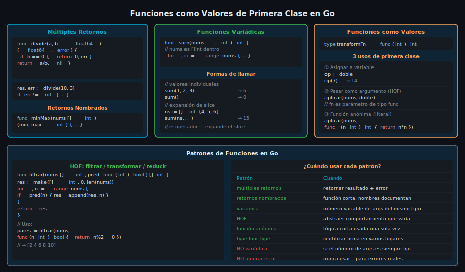

# Funciones y Múltiples Retornos



## 🎯 Objetivos

- Declarar funciones con **múltiples valores de retorno** y capturarlos correctamente
- Usar **retornos nombrados** para documentar la intención de la función
- Escribir **funciones variádicas** que acepten un número variable de argumentos
- Tratar funciones como **valores de primera clase**: asignarlas, pasarlas y retornarlas

---

## 1. Declaración básica y múltiples retornos

En Go, una función puede retornar más de un valor. Esta característica es fundamental en el lenguaje: se usa para retornar un resultado _y_ un error simultáneamente, eliminando la necesidad de excepciones.

```go
// divide retorna el cociente y un error si el divisor es cero.
// Patrón canónico en Go: (resultado, error)
func divide(a, b float64) (float64, error) {
    if b == 0 {
        // fmt.Errorf crea un error con mensaje formateado
        return 0, fmt.Errorf("divide: divisor no puede ser cero")
    }
    return a / b, nil // nil significa "sin error"
}

func main() {
    // Los múltiples retornos se capturan con declaración corta
    resultado, err := divide(10, 3)
    if err != nil {
        fmt.Println("Error:", err)
        return
    }
    fmt.Printf("Resultado: %.2f\n", resultado) // Resultado: 3.33
}
```

> El patrón `(valor, error)` es el idioma más común en Go. Siempre verifica el error antes de usar el valor.

También puedes ignorar un retorno con `_` cuando sabes que no lo necesitas:

```go
// Ignorar el índice cuando solo importa el valor
for _, planeta := range planetas {
    fmt.Println(planeta)
}

// Ignorar el error SOLO cuando es imposible que ocurra — documenta el porqué
n, _ := fmt.Println("texto") // Println sobre stdout no falla en condiciones normales
_ = n
```

---

## 2. Retornos nombrados

Go permite nombrar los valores de retorno en la firma de la función. Los retornos nombrados:

1. Actúan como variables locales declaradas al inicio de la función
2. Permiten el `return` desnudo (`naked return`) — retorna los valores actuales
3. Documentan el significado de cada retorno directamente en la firma

```go
// minMax retorna el mínimo y máximo de un slice.
// Los nombres 'min' y 'max' documentan qué representa cada valor.
func minMax(nums []int) (min, max int) {
    if len(nums) == 0 {
        return // naked return: retorna min=0, max=0 (zero values)
    }
    min, max = nums[0], nums[0]
    for _, n := range nums[1:] {
        if n < min {
            min = n
        }
        if n > max {
            max = n
        }
    }
    return // naked return: retorna los valores actuales de min y max
}
```

> Usa retornos nombrados cuando la función es corta y los nombres agregan claridad. Evítalos en funciones largas donde el `naked return` puede confundir.

---

## 3. Funciones variádicas

Una función variádica acepta un número variable de argumentos del mismo tipo. Se declara con `...T` como último parámetro. Dentro de la función, ese parámetro es un `[]T` (slice).

```go
// sum acepta cualquier cantidad de enteros y retorna su suma.
// nums es []int dentro de la función, aunque se llama con valores individuales.
func sum(nums ...int) int {
    total := 0
    for _, n := range nums {
        total += n
    }
    return total
}

func main() {
    fmt.Println(sum(1, 2, 3))       // 6 — llamada con valores individuales
    fmt.Println(sum(10, 20))        // 30
    fmt.Println(sum())              // 0 — cero argumentos es válido

    // Para pasar un slice existente, usar el operador de expansión ...
    numeros := []int{4, 5, 6}
    fmt.Println(sum(numeros...))    // 15 — expande el slice como argumentos
}
```

`fmt.Println` es en sí una función variádica: `func Println(a ...any) (n int, err error)`.

---

## 4. Funciones como valores de primera clase

En Go, las funciones son **valores de primera clase** (`first-class values`). Esto significa que una función puede:

- Asignarse a una variable
- Pasarse como argumento a otra función
- Retornarse desde otra función

```go
// Tipo de función: func(int) int
// Se puede usar como cualquier otro tipo
type transformFn func(int) int

// doble y triple son funciones del tipo transformFn
func doble(n int) int  { return n * 2 }
func triple(n int) int { return n * 3 }

// aplicar recibe una función como argumento — esto es HOF (higher-order function)
func aplicar(nums []int, fn transformFn) []int {
    resultado := make([]int, len(nums))
    for i, n := range nums {
        resultado[i] = fn(n)
    }
    return resultado
}

func main() {
    nums := []int{1, 2, 3, 4, 5}

    // Pasar función como argumento
    fmt.Println(aplicar(nums, doble))  // [2 4 6 8 10]
    fmt.Println(aplicar(nums, triple)) // [3 6 9 12 15]

    // Asignar función a variable y llamarla
    operacion := doble
    fmt.Println(operacion(7)) // 14

    // Función anónima (literal de función) pasada directamente
    fmt.Println(aplicar(nums, func(n int) int { return n * n })) // [1 4 9 16 25]
}
```

---

## 5. Errores comunes con funciones

### 5.1 Ignorar el segundo retorno (el error)

```go
// ❌ INCORRECTO — ignorar el error puede provocar comportamiento inesperado
resultado, _ := strconv.Atoi("abc") // Atoi falla pero lo ignoramos
fmt.Println(resultado)               // imprime 0 (zero value), silenciosamente incorrecto

// ✅ CORRECTO — siempre verifica el error
n, err := strconv.Atoi("abc")
if err != nil {
    fmt.Println("Error de conversión:", err)
    return
}
fmt.Println(n)
```

### 5.2 Modificar un slice variádico original sin querer

```go
// Las funciones variádicas reciben un slice — modificarlo afecta al original
func agregarCero(nums ...int) []int {
    nums = append(nums, 0) // esto NO modifica el slice original (append crea uno nuevo)
    return nums
}

// Pero esto sí modifica el original:
func multiplicarPorDos(nums ...int) {
    for i := range nums {
        nums[i] *= 2 // modifica el backing array compartido si se pasó con ...
    }
}
```

---

## ✅ Checklist de verificación

- [ ] ¿Puedo declarar una función con múltiples retornos y capturar ambos valores?
- [ ] ¿Entiendo cuándo usar retornos nombrados vs retornos explícitos?
- [ ] ¿Sé cómo declarar y llamar funciones variádicas, incluyendo la expansión con `...`?
- [ ] ¿Puedo asignar una función a una variable y pasarla como argumento?
- [ ] ¿Verifico siempre el error antes de usar el valor retornado?

---

## 📚 Recursos adicionales

- [Effective Go — Functions](https://go.dev/doc/effective_go#functions)
- [A Tour of Go — Multiple return values](https://go.dev/tour/basics/6)
- [A Tour of Go — Variadic functions](https://go.dev/tour/moretypes/15)
- [Go by Example — Multiple Return Values](https://gobyexample.com/multiple-return-values)
