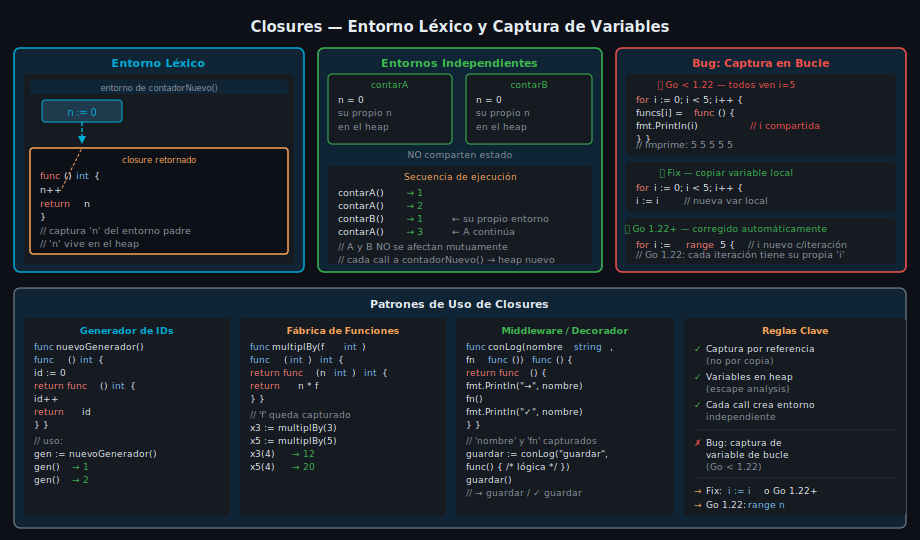

# Closures y Funciones de Orden Superior



## 🎯 Objetivos

- Comprender qué es un **closure** y cómo captura variables de su entorno léxico
- Construir closures para **encapsular estado** sin structs
- Identificar y corregir el **bug clásico de captura en bucle**
- Escribir **funciones de orden superior** (HOF) que compongan comportamiento

---

## 1. Qué es un closure

Un **closure** es una función que "recuerda" las variables del entorno donde fue creada, incluso después de que ese entorno haya dejado de estar activo. En Go, cualquier función literal que referencie variables externas es un closure.

```go
// contadorNuevo retorna una función — el closure
// Cada llamada a contadorNuevo crea un entorno independiente con su propia 'n'
func contadorNuevo() func() int {
    n := 0 // esta variable vive en el heap, no en el stack
    return func() int {
        n++    // el closure captura 'n' por referencia
        return n
    }
}

func main() {
    contarA := contadorNuevo()
    contarB := contadorNuevo() // entorno completamente independiente

    fmt.Println(contarA()) // 1
    fmt.Println(contarA()) // 2
    fmt.Println(contarA()) // 3
    fmt.Println(contarB()) // 1 — contarB tiene su propia 'n'
    fmt.Println(contarA()) // 4 — contarA continúa desde donde estaba
}
```

> El compilador de Go detecta automáticamente qué variables escapan al heap. No necesitas gestionar memoria manualmente.

---

## 2. Closures para encapsular estado

Los closures son una forma idiomática de encapsular estado privado sin definir un struct. Son especialmente útiles para generadores, filtros y configuraciones:

```go
// multiplicadorPor retorna una función que multiplica por factor.
// 'factor' queda "atrapado" en el closure.
func multiplicadorPor(factor int) func(int) int {
    return func(n int) int {
        return n * factor
    }
}

// prefijador retorna una función que antepone un prefijo a strings.
func prefijador(prefijo string) func(string) string {
    return func(s string) string {
        return prefijo + s
    }
}

func main() {
    triplicar := multiplicadorPor(3)
    quintuplicar := multiplicadorPor(5)

    fmt.Println(triplicar(4))    // 12
    fmt.Println(quintuplicar(4)) // 20

    // Closures con strings
    advertir := prefijador("[WARN] ")
    informar := prefijador("[INFO] ")

    fmt.Println(advertir("disco casi lleno"))    // [WARN] disco casi lleno
    fmt.Println(informar("servidor iniciado"))   // [INFO] servidor iniciado
}
```

---

## 3. Bug clásico: captura de variable de bucle

El error más común con closures en Go es capturar la _variable de iteración_ en lugar de su _valor en ese momento_. Todos los closures terminan viendo el mismo valor final.

```go
// ❌ INCORRECTO — todos los closures capturan la misma variable 'i'
funcs := make([]func(), 5)
for i := 0; i < 5; i++ {
    funcs[i] = func() {
        fmt.Println(i) // captura 'i' por referencia, no por valor
    }
}
for _, f := range funcs {
    f() // imprime 5, 5, 5, 5, 5 — 'i' ya llegó a 5 al final del loop
}

// ✅ FIX 1 — crear una copia local de 'i' dentro del bucle (Go < 1.22)
for i := 0; i < 5; i++ {
    i := i // nueva variable 'i' en cada iteración, sombrea la externa
    funcs[i] = func() {
        fmt.Println(i) // captura la copia local
    }
}

// ✅ FIX 2 — Go 1.22+: la variable de bucle es nueva en cada iteración
// (comportamiento cambiado, el bug ya no existe con Go 1.22+)
for i := range 5 { // Go 1.22: range sobre entero, 'i' nuevo cada vez
    funcs[i] = func() {
        fmt.Println(i) // correcto en Go 1.22+
    }
}
```

> Con Go 1.22+ el bug de captura en bucles `for` fue corregido: cada iteración tiene su propia copia de la variable. El FIX 1 sigue siendo válido y portable.

---

## 4. Funciones de orden superior (HOF)

Una **función de orden superior** es aquella que recibe una función como argumento y/o retorna una función. Son el núcleo de la programación funcional en Go.

```go
// filtrar retorna un nuevo slice con los elementos que satisfacen el predicado.
// predicate es una función que recibe T y retorna bool.
func filtrar(nums []int, predicado func(int) bool) []int {
    resultado := make([]int, 0, len(nums))
    for _, n := range nums {
        if predicado(n) {
            resultado = append(resultado, n)
        }
    }
    return resultado
}

// transformar aplica fn a cada elemento y retorna un nuevo slice.
func transformar(nums []int, fn func(int) int) []int {
    resultado := make([]int, len(nums))
    for i, n := range nums {
        resultado[i] = fn(n)
    }
    return resultado
}

// reducir combina todos los elementos usando fn, partiendo de inicial.
func reducir(nums []int, inicial int, fn func(int, int) int) int {
    acc := inicial
    for _, n := range nums {
        acc = fn(acc, n)
    }
    return acc
}

func main() {
    nums := []int{1, 2, 3, 4, 5, 6, 7, 8, 9, 10}

    // Filtrar pares
    pares := filtrar(nums, func(n int) bool { return n%2 == 0 })
    fmt.Println(pares) // [2 4 6 8 10]

    // Transformar: elevar al cuadrado
    cuadrados := transformar(pares, func(n int) int { return n * n })
    fmt.Println(cuadrados) // [4 16 36 64 100]

    // Reducir: sumar todo
    suma := reducir(cuadrados, 0, func(acc, n int) int { return acc + n })
    fmt.Println(suma) // 220
}
```

---

## 5. Closures como middleware y decoradores

Un patrón muy poderoso: usar closures para _envolver_ una función y agregar comportamiento antes o después sin modificarla. Este patrón es la base del middleware en servidores HTTP.

```go
// conTemporizador envuelve cualquier función y mide su duración.
// Retorna una función con la misma firma — un closure que agrega comportamiento.
func conTemporizador(nombre string, fn func()) func() {
    return func() {
        inicio := time.Now()
        fn()                              // llama a la función original
        duracion := time.Since(inicio)
        fmt.Printf("[%s] tardó %v\n", nombre, duracion)
    }
}

// conLogger agrega logging antes y después de ejecutar fn.
func conLogger(nombre string, fn func() error) func() error {
    return func() error {
        fmt.Printf("→ iniciando %s\n", nombre)
        err := fn()
        if err != nil {
            fmt.Printf("✗ %s falló: %v\n", nombre, err)
            return err
        }
        fmt.Printf("✓ %s completado\n", nombre)
        return nil
    }
}
```

---

## ✅ Checklist de verificación

- [ ] ¿Puedo explicar qué variable captura un closure y por qué vive en el heap?
- [ ] ¿Sé crear un closure que encapsule estado como un contador o generador?
- [ ] ¿Reconozco el bug de captura en bucle y sé cómo corregirlo?
- [ ] ¿Puedo implementar `filtrar`, `transformar` y `reducir` usando HOF?
- [ ] ¿Entiendo cómo los closures se usan para construir middleware?

---

## 📚 Recursos adicionales

- [A Tour of Go — Closures](https://go.dev/tour/moretypes/25)
- [Effective Go — Functions](https://go.dev/doc/effective_go#functions)
- [Go Blog — Closures and the loop variable](https://go.dev/blog/loopvar-semantics)
- [Go by Example — Closures](https://gobyexample.com/closures)
