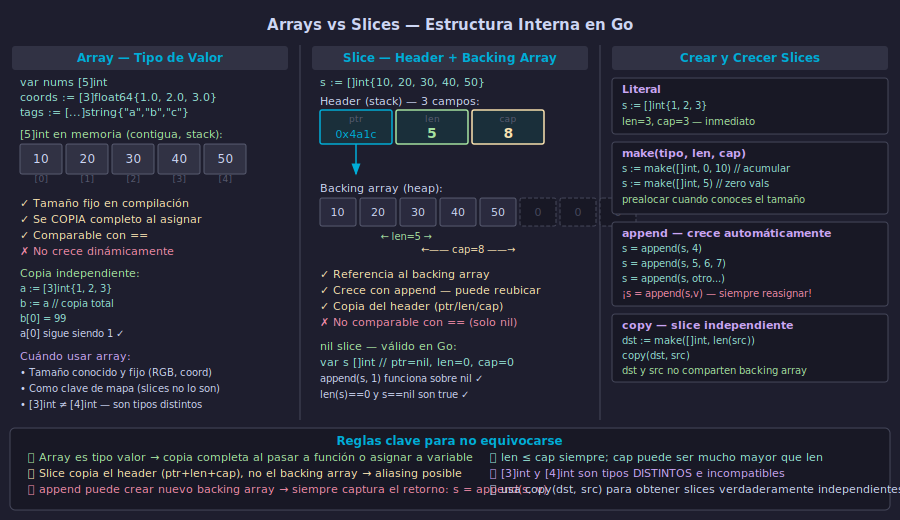

# Arrays en Go



## 🎯 Objetivos

- Declarar arrays de tamaño fijo con tipos escalares y compuestos
- Comprender la semántica de valor: copia total al asignar o pasar a funciones
- Iterar arrays con `for` de índice y con `range`
- Comparar arrays con `==` e identificar cuándo son preferibles a los slices

---

## 1. Declaración e inicialización

Un array en Go tiene **tamaño fijo definido en compilación**. El tamaño es parte del tipo: `[3]int` y `[5]int` son tipos distintos e incompatibles.

```go
// Array con zero value — todos los elementos valen 0, "", false, etc.
var puntuaciones [5]int

// Array literal — inicialización explícita
colores := [3]string{"rojo", "verde", "azul"}

// Tamaño inferido con ... — el compilador cuenta los elementos
planetas := [...]string{"Mercurio", "Venus", "Tierra", "Marte"}
fmt.Println(len(planetas)) // 4

// Array multidimensional (raro en Go, slices de slices es más idiomático)
var tablero [3][3]int // tablero de 3×3, todos ceros
```

Acceder por índice es O(1) y el compilador detecta accesos fuera de rango en tiempo de compilación cuando el índice es constante.

```go
colores := [3]string{"rojo", "verde", "azul"}
fmt.Println(colores[0]) // "rojo"
colores[1] = "amarillo"
fmt.Println(colores)    // [rojo amarillo azul]

// Acceso fuera de rango — pánico en tiempo de ejecución
// fmt.Println(colores[5]) // runtime: index out of range [5] with length 3
```

---

## 2. Semántica de valor — copia total

Los arrays son **tipos de valor** en Go. Esto los diferencia radicalmente de los slices. Cuando asignas un array a otra variable o lo pasas a una función, se copia **todo el contenido**.

```go
// Asignación: copia independiente
original := [3]int{10, 20, 30}
copia := original
copia[0] = 99

fmt.Println("original:", original) // [10 20 30] — sin cambios
fmt.Println("copia:   ", copia)    // [99 20 30]
```

Para evitar la copia al pasar a funciones, se usa un puntero al array:

```go
// Sin puntero: la función recibe una copia, no modifica el original
func sumar(arr [3]int) int {
    total := 0
    for _, v := range arr {
        total += v
    }
    return total
}

// Con puntero: la función puede modificar el array original
func triplicar(arr *[3]int) {
    for i := range arr {
        arr[i] *= 3
    }
}

nums := [3]int{1, 2, 3}
triplicar(&nums)
fmt.Println(nums) // [3 6 9]
```

> La semántica de valor es predecible y segura. El costo de copia puede ser relevante para arrays grandes (cientos de elementos); en ese caso, usa un puntero o un slice.

---

## 3. Iteración con for y range

Go tiene **una sola construcción de bucle** (`for`) que sirve para todos los casos. Con `range` sobre un array se obtiene el índice y el valor en cada iteración.

```go
temperaturas := [7]float64{22.5, 24.0, 19.3, 21.8, 25.1, 23.4, 20.7}

// range devuelve (índice, copia del valor)
var suma float64
for i, temp := range temperaturas {
    fmt.Printf("Día %d: %.1f°C\n", i+1, temp)
    suma += temp
}
fmt.Printf("Promedio semanal: %.2f°C\n", suma/float64(len(temperaturas)))
```

Cuando solo necesitas el valor, descarta el índice con `_`:

```go
var maximo float64
for _, temp := range temperaturas {
    if temp > maximo {
        maximo = temp
    }
}
fmt.Printf("Temperatura máxima: %.1f°C\n", maximo)
```

El bucle clásico con índice es útil cuando necesitas el índice para lógica adicional:

```go
// Buscar el primer elemento mayor que un umbral
umbral := 24.0
for i := 0; i < len(temperaturas); i++ {
    if temperaturas[i] > umbral {
        fmt.Printf("Primera temperatura sobre %.1f°C: día %d\n", umbral, i+1)
        break
    }
}
```

---

## 4. Comparación con == y arrays como claves de mapa

Los arrays son **comparables** si el tipo de sus elementos es comparable. Esto los hace únicos respecto a los slices (que nunca son comparables con `==`).

```go
a := [3]int{1, 2, 3}
b := [3]int{1, 2, 3}
c := [3]int{1, 2, 4}

fmt.Println(a == b) // true — misma longitud y mismos valores
fmt.Println(a == c) // false — difieren en el último elemento
```

La comparabilidad permite usar arrays como **claves de mapa**, algo imposible con slices:

```go
// Arrays como claves — patrón útil para coordenadas, hashes cortos, etc.
type Coordenada [2]float64

ciudades := map[Coordenada]string{
    {40.4168, -3.7038}: "Madrid",
    {48.8566, 2.3522}:  "París",
    {51.5074, -0.1278}: "Londres",
}

buscar := Coordenada{40.4168, -3.7038}
if ciudad, ok := ciudades[buscar]; ok {
    fmt.Println("Ciudad encontrada:", ciudad) // Madrid
}
```

---

## 5. Cuándo usar arrays vs slices

En la práctica, la mayoría del código Go usa **slices**, no arrays. Los arrays tienen su lugar en situaciones específicas:

| Situación | Usar array | Usar slice |
|-----------|-----------|-----------|
| Tamaño fijo conocido en compilación | ✓ | — |
| Como clave de mapa | ✓ | ✗ (slices no son comparables) |
| Necesitas crecer dinámicamente | — | ✓ |
| Pasar a funciones sin copia costosa | — | ✓ |
| Colección de tamaño variable | — | ✓ |

```go
// Array: tipo de clave para un mapa de rutas
type Ruta [2]string // [origen, destino]

tiempos := map[Ruta]int{
    {"Madrid", "Barcelona"}: 180,
    {"Madrid", "Valencia"}:  210,
}
fmt.Println(tiempos[Ruta{"Madrid", "Barcelona"}]) // 180

// Slice: colección que crece con el tiempo
var registros []string
registros = append(registros, "entrada 1")
registros = append(registros, "entrada 2")
```

---

## ✅ Checklist de verificación

- [ ] ¿Puedes declarar un array con literal y con zero value?
- [ ] ¿Sabes por qué `[3]int` y `[4]int` son tipos distintos e incompatibles?
- [ ] ¿Entiendes cuándo la semántica de copia es útil y cuándo puede ser costosa?
- [ ] ¿Usas `range` para iterar en lugar del bucle `for` con índice manual?
- [ ] ¿Puedes comparar dos arrays con `==` y usarlos como claves de mapa?

---

## 📚 Recursos adicionales

- [Effective Go — Arrays](https://go.dev/doc/effective_go#arrays)
- [Go Spec — Array types](https://go.dev/ref/spec#Array_types)
- [Go by Example — Arrays](https://gobyexample.com/arrays)
- [pkg.go.dev — builtin len/cap](https://pkg.go.dev/builtin#len)
