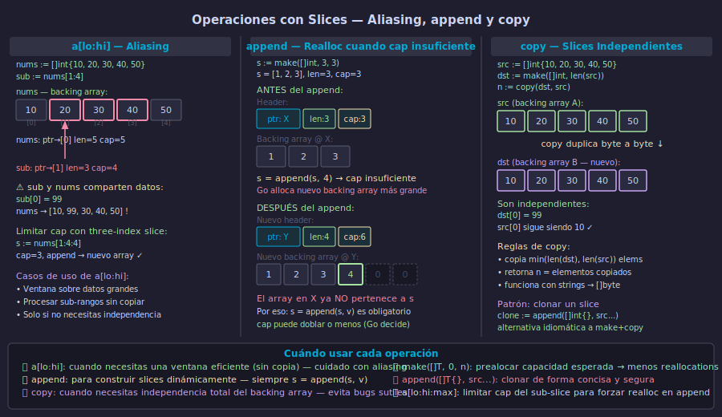

# Slices: Internals, make y append



## 🎯 Objetivos

- Entender la estructura interna de un slice: puntero, len y cap
- Crear slices con literales, `make` y desde nil con `append`
- Aplicar slicing `a[lo:hi]` y reconocer el aliasing del backing array
- Usar `copy` para obtener slices verdaderamente independientes
- Aplicar patrones idiomáticos: prealocar con `make`, filtrar con nil slice

---

## 1. La estructura interna del slice

Un slice **no es un array**. Internamente es una estructura de tres campos (el "slice header"):

```go
// Representación conceptual del header de un slice
// (esto NO es código real, es para entender la estructura)
type sliceHeader struct {
    ptr unsafe.Pointer // puntero al primer elemento accesible en el backing array
    len int            // número de elementos accesibles
    cap int            // número total de elementos desde ptr hasta el fin del array
}
```

Esto tiene consecuencias importantes: cuando pasas un slice a una función, se **copia el header** (ptr, len, cap), pero el backing array subyacente se **comparte**.

```go
func modificar(s []int) {
    // Esta línea SÍ modifica el backing array original (compartido)
    s[0] = 99

    // Esta línea solo modifica la copia local del header
    // El slice original NO ve el nuevo elemento
    s = append(s, 100)
}

nums := []int{1, 2, 3}
modificar(nums)
fmt.Println(nums) // [99 2 3] — s[0]=99 se propagó, append no
```

> El backing array se asigna en el heap; el header puede vivir en el stack o en el heap dependiendo del contexto.

---

## 2. Crear slices: literal, make y nil

Go ofrece varias formas de crear slices según la situación:

```go
// Literal: crea backing array con exactamente esos elementos
frutas := []string{"manzana", "pera", "uva"} // len=3, cap=3

// make(tipo, len, cap): preasigna capacidad sin inicializar elementos
// Idiomático cuando conoces el tamaño máximo esperado
eventos := make([]string, 0, 20) // len=0, cap=20 — listo para append

// make(tipo, len): inicializa len elementos con zero value
precios := make([]float64, 5) // [0.0, 0.0, 0.0, 0.0, 0.0]
```

El nil slice es perfectamente válido en Go. `append` funciona sobre él:

```go
var pendientes []string // nil slice — ptr=nil, len=0, cap=0

// len y cap devuelven 0 sobre nil slice
fmt.Println(len(pendientes), cap(pendientes)) // 0 0
fmt.Println(pendientes == nil)                // true

// append funciona sobre nil slice — no hay pánico
pendientes = append(pendientes, "tarea 1")
fmt.Println(pendientes) // [tarea 1]
```

Regla práctica: usa `var s []T` (nil slice) cuando no sabes si habrá elementos. Usa `make([]T, 0, n)` cuando conoces el tamaño aproximado y quieres evitar reallocations.

---

## 3. append y realloc — el backing array puede cambiar

`append` añade elementos al final del slice. Si `len == cap`, Go **crea un nuevo backing array** más grande y copia todos los datos. El slice original queda desconectado del nuevo array.

```go
s := make([]int, 3, 3) // len=3, cap=3
fmt.Println(len(s), cap(s)) // 3 3

// cap insuficiente → Go alloca nuevo backing array
s = append(s, 4)
fmt.Println(len(s), cap(s)) // 4 6  (cap aumentó — Go puede doblar o usar otra estrategia)

// append con múltiples elementos
s = append(s, 5, 6, 7)

// append de otro slice completo con ...
extra := []int{8, 9, 10}
s = append(s, extra...)
```

**La regla de oro**: siempre reasignar el resultado de `append`. Ignorar el valor de retorno es un bug silencioso:

```go
// ❌ INCORRECTO — el append puede crear un nuevo slice que se pierde
append(s, valor)

// ✅ CORRECTO — siempre capturar el retorno
s = append(s, valor)
```

---

## 4. Slicing a[lo:hi] y el aliasing del backing array

El operador `a[lo:hi]` crea un nuevo header que apunta **al mismo backing array**. Esto es eficiente (sin copia), pero puede causar bugs si no se tiene en cuenta:

```go
nums := []int{10, 20, 30, 40, 50}

// sub apunta al mismo backing array desde el índice 1
sub := nums[1:4] // header: ptr=&nums[1], len=3, cap=4
fmt.Println(sub) // [20 30 40]

// Modificar sub TAMBIÉN modifica nums
sub[0] = 99
fmt.Println(nums) // [10 99 30 40 50] — ¡inesperado!
```

Para obtener un slice independiente, usa `copy`:

```go
nums := []int{10, 20, 30, 40, 50}

// Copia independiente del sub-rango
independiente := make([]int, 3)
copy(independiente, nums[1:4])

independiente[0] = 99
fmt.Println(nums)         // [10 20 30 40 50] — sin cambios ✓
fmt.Println(independiente) // [99 30 40]
```

El three-index slice `a[lo:hi:max]` limita la capacidad del sub-slice, forzando realloc en el próximo `append` y evitando que modifique el array original:

```go
// sin three-index: append puede sobreescribir nums[4]
sub1 := nums[1:4]      // cap=4, puede llegar hasta nums[4]

// con three-index: append siempre crea nuevo array
sub2 := nums[1:4:4]    // cap=3, append fuerza nuevo backing array
```

---

## 5. Patrones idiomáticos con slices

**Filtrado con nil slice**: reutilizar la misma variable evitando allocations extra:

```go
// filtrarPositivos retorna un nuevo slice con solo los valores positivos.
func filtrarPositivos(nums []int) []int {
    // nil slice: len=0, append asigna backing array solo si hay elementos
    var resultado []int
    for _, n := range nums {
        if n > 0 {
            resultado = append(resultado, n)
        }
    }
    return resultado
}
```

**Prealocar con make cuando conoces el tamaño**:

```go
// duplicar retorna un nuevo slice con cada valor multiplicado por 2.
func duplicar(s []int) []int {
    // preasignamos capacidad exacta para evitar todas las reallocations
    resultado := make([]int, 0, len(s))
    for _, v := range s {
        resultado = append(resultado, v*2)
    }
    return resultado
}
```

**Clonar un slice de forma concisa**:

```go
original := []int{1, 2, 3, 4, 5}

// Opción 1: make + copy (explícito, idiomático)
clon1 := make([]int, len(original))
copy(clon1, original)

// Opción 2: append con expansión ... (conciso, también idiomático)
clon2 := append([]int{}, original...)
```

---

## ✅ Checklist de verificación

- [ ] ¿Puedes explicar los tres campos del slice header (ptr, len, cap)?
- [ ] ¿Sabes qué ocurre al backing array cuando `append` supera la cap?
- [ ] ¿Entiendes por qué `a[lo:hi]` puede causar aliasing inesperado?
- [ ] ¿Usas `copy` cuando necesitas un slice verdaderamente independiente?
- [ ] ¿Preasignas capacidad con `make([]T, 0, n)` cuando conoces el tamaño?
- [ ] ¿Siempre reasignas el resultado de append: `s = append(s, v)`?

---

## 📚 Recursos adicionales

- [The Go Blog — Go Slices: usage and internals](https://go.dev/blog/slices-intro)
- [Effective Go — Slices](https://go.dev/doc/effective_go#slices)
- [Go by Example — Slices](https://gobyexample.com/slices)
- [pkg.go.dev — builtin append y copy](https://pkg.go.dev/builtin#append)
