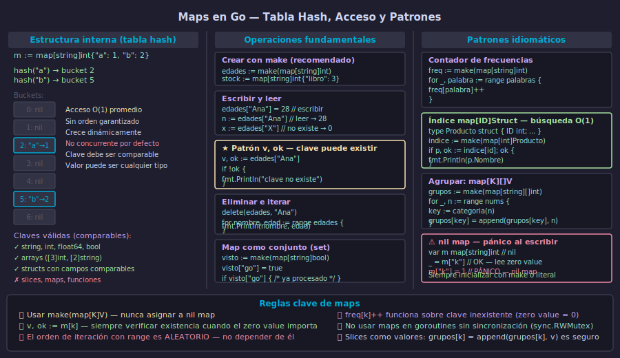

# Maps en Go — Tabla Hash, Acceso y Patrones



## 🎯 Objetivos

- Declarar y crear maps con `make` y literales
- Aplicar el patrón `v, ok := m[k]` para acceso seguro
- Recorrer maps con `range` y usar `delete`
- Implementar patrones idiomáticos: contador de frecuencias, índice y conjunto

---

## 1. Qué es un map y cómo funciona internamente

Un **map** en Go es una estructura de datos tipo *tabla hash*: asocia claves únicas con valores. Su característica principal es que el acceso, inserción y eliminación son O(1) en promedio, sin importar cuántas entradas contenga.

Internamente, Go distribuye las claves en **buckets** (cubetas) usando una función hash. Cuando la clave no existe en el mapa, Go retorna el **zero value** del tipo del valor, sin producir error ni pánico.

```go
// Map vacío creado con make — listo para usar
edades := make(map[string]int)

// Literal: declara y popula al mismo tiempo
colores := map[string]string{
    "rojo":  "#ff0000",
    "verde": "#00ff00",
    "azul":  "#0000ff",
}
```

Dos aspectos críticos para el trabajo diario:

- **El orden de iteración es aleatorio**: cada vez que iteras con `range` el orden puede ser diferente.
- **Un map nil acepta lecturas pero hace pánico al escribir**: siempre inicializar con `make` o literal.

---

## 2. Declarar, asignar y leer

Hay tres formas de declarar un map, pero solo dos son seguras para escritura:

```go
// ✅ Forma 1: make (preferida cuando empezamos vacío)
stock := make(map[string]int)
stock["manzana"] = 10
stock["naranja"] = 5

// ✅ Forma 2: literal con valores iniciales
precios := map[string]float64{
    "manzana": 1.20,
    "naranja": 0.90,
}

// ❌ Forma 3: var — el map es nil, PÁNICO al escribir
var m map[string]int
// m["clave"] = 1 → pánico: assignment to entry in nil map
_ = m["clave"] // leer de nil map sí es válido → retorna 0
```

Al leer una clave que no existe, Go retorna el zero value del tipo del valor. Para `int` es `0`, para `string` es `""`, para `bool` es `false`. Esto puede ser confuso: ¿el valor es `0` porque la clave no existe, o porque fue asignado explícitamente como `0`?

---

## 3. Patrón `v, ok` — verificación de existencia

Cuando el zero value puede confundirse con un valor real, usa el **patrón de dos retornos**:

```go
edades := map[string]int{
    "Ana":   28,
    "Bruno": 0, // edad explícitamente 0 (ej: recién nacido)
}

// Sin patrón v, ok — ambiguo
n := edades["Carlos"] // → 0, pero ¿existe Carlos o no?

// Con patrón v, ok — sin ambigüedad
edad, ok := edades["Carlos"]
if !ok {
    fmt.Println("Carlos no está registrado")
} else {
    fmt.Printf("Carlos tiene %d años\n", edad)
}

// Verificación inline con if — idiomático en Go
if edad, ok := edades["Bruno"]; ok {
    fmt.Printf("Bruno tiene %d años\n", edad)
}
```

La variable `ok` es un `bool`: `true` si la clave existe, `false` si no. Es el mismo patrón que se usa con type assertions, lecturas de channel y conversiones de interfaz en Go.

---

## 4. Iterar y eliminar entradas

Para recorrer todas las entradas de un map se usa `range`. El orden no está garantizado:

```go
inventario := map[string]int{
    "tornillo": 200,
    "tuerca":   150,
    "clavo":    300,
}

// Recorrer clave y valor
for producto, cantidad := range inventario {
    fmt.Printf("%-10s: %d unidades\n", producto, cantidad)
}

// Solo claves
for producto := range inventario {
    fmt.Println(producto)
}

// Eliminar una entrada con delete
delete(inventario, "tuerca")

// delete sobre clave inexistente no produce error
delete(inventario, "tornillo_gigante") // seguro, no hace nada
```

Para vaciar un map completamente, desde Go 1.21 existe `clear`:

```go
clear(inventario) // equivale a eliminar todas las entradas
```

---

## 5. Patrones idiomáticos con maps

### Contador de frecuencias

El patrón más común. Funciona gracias al zero value: si la clave no existe, `freq[k]` retorna `0`, y `0 + 1 = 1`.

```go
palabras := []string{"go", "es", "rápido", "go", "es", "go"}

freq := make(map[string]int)
for _, p := range palabras {
    freq[p]++ // si no existe, parte de 0
}
// freq → {"go":3, "es":2, "rápido":1}
```

### Map como conjunto (set)

Go no tiene un tipo `set` nativo. Se simula con `map[T]bool` o `map[T]struct{}`:

```go
// Usando bool — más legible
vistos := make(map[string]bool)
vistos["go"] = true
vistos["rust"] = true

if vistos["go"] {
    fmt.Println("go ya fue procesado")
}

// Usando struct{} — más eficiente en memoria (no ocupa espacio el valor)
visitados := make(map[string]struct{})
visitados["a"] = struct{}{}
_, existe := visitados["b"] // existe == false
```

### Índice `map[ID]Struct` para búsqueda O(1)

Este patrón es el núcleo del proyecto de esta semana. Combina un slice para mantener el orden y un map para búsquedas rápidas:

```go
type Producto struct {
    ID     int
    Nombre string
    Precio float64
}

catalogo := []Producto{}
indice   := make(map[int]Producto)

// Agregar — actualiza ambas estructuras
agregar := func(p Producto) {
    catalogo = append(catalogo, p)
    indice[p.ID] = p
}

agregar(Producto{ID: 1, Nombre: "Cuaderno", Precio: 2.50})
agregar(Producto{ID: 2, Nombre: "Pluma", Precio: 0.80})

// Buscar — O(1) con el map
if p, ok := indice[1]; ok {
    fmt.Println(p.Nombre) // "Cuaderno"
}
```

---

## ✅ Checklist de verificación

- [ ] ¿Siempre inicializo el map con `make` o literal antes de escribir?
- [ ] ¿Uso el patrón `v, ok := m[k]` cuando el zero value podría confundirse con un valor real?
- [ ] ¿Entiendo que el orden de iteración con `range` en maps no está garantizado?
- [ ] ¿Sé que `freq[k]++` funciona correctamente aunque la clave no exista (parte de zero value `0`)?
- [ ] ¿Puedo implementar el patrón slice+map para mantener orden y tener búsqueda O(1)?

## 📚 Recursos adicionales

- [Go Maps in Action — Go Blog](https://go.dev/blog/maps)
- [Effective Go — Maps](https://go.dev/doc/effective_go#maps)
- [pkg.go.dev — builtin: delete, clear](https://pkg.go.dev/builtin#delete)
- [Go by Example — Maps](https://gobyexample.com/maps)
