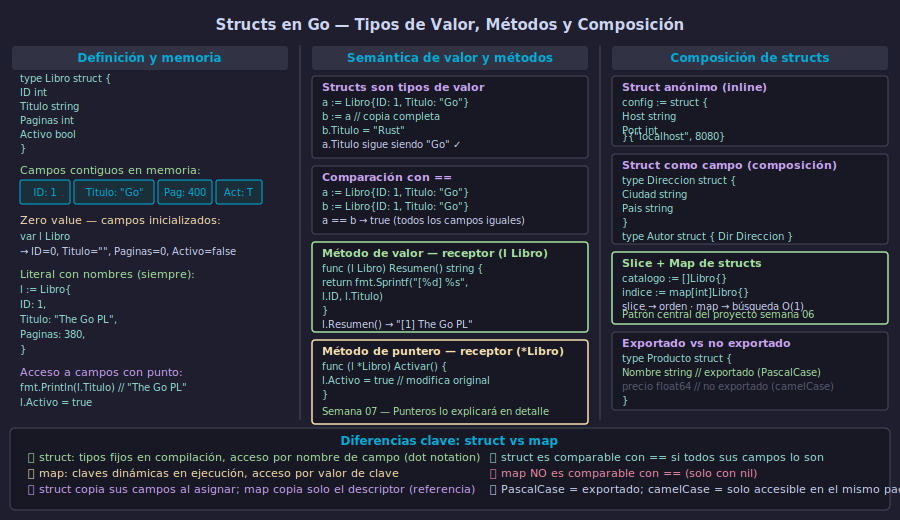

# Structs en Go — Definición, Zero Value y Métodos de Valor



## 🎯 Objetivos

- Definir structs con campos tipados y usar el zero value correctamente
- Inicializar structs con literales nombrando cada campo
- Comprender la semántica de valor y cómo difieren structs de maps
- Implementar métodos de valor con receptor `(t Tipo)`

---

## 1. Qué es un struct y por qué usarlo

Un **struct** es un tipo compuesto que agrupa un conjunto fijo de campos con nombre y tipo. A diferencia de un map, los campos de un struct se conocen en tiempo de compilación: el compilador verifica que accedas solo a campos que existen.

```go
// Definición: fuera de cualquier función, al nivel del paquete
type Empleado struct {
    ID       int
    Nombre   string
    Salario  float64
    Activo   bool
}
```

Cada campo tiene un nombre (PascalCase si es exportado, camelCase si es privado) y un tipo. Los campos se acceden con el operador punto: `e.Nombre`.

La diferencia clave frente a los maps:

| | struct | map |
|-|--------|-----|
| Tipos de campos | fijos en compilación | el mismo tipo para todos los valores |
| Acceso | `e.Nombre` — verificado por el compilador | `m["nombre"]` — dinámico en ejecución |
| Semántica | **valor** (copia completa al asignar) | **referencia** (copia el descriptor) |
| Comparable con `==` | sí, si todos sus campos lo son | no, solo con `nil` |

---

## 2. Zero value y literales con nombre de campo

Cuando declaras un struct sin valor inicial, Go inicializa cada campo con su zero value: `0` para numéricos, `""` para string, `false` para bool, `nil` para punteros y slices.

```go
// Zero value automático — todos los campos en su estado base
var e Empleado
// e.ID = 0, e.Nombre = "", e.Salario = 0.0, e.Activo = false

fmt.Println(e.Nombre == "")  // true
fmt.Println(e.Salario == 0)  // true
```

Para crear structs con valores específicos, usa literales **siempre con nombre de campo**. El formato sin nombres es frágil: si agregas un campo al struct en el futuro, el código rompe.

```go
// ✅ Con nombres de campo — robusto ante cambios futuros
e1 := Empleado{
    ID:      42,
    Nombre:  "María Torres",
    Salario: 3500.00,
    Activo:  true,
}

// ❌ Sin nombres de campo — se rompe si el struct cambia
e2 := Empleado{42, "María Torres", 3500.00, true}

// Inicialización parcial — campos omitidos usan zero value
e3 := Empleado{
    ID:     99,
    Nombre: "Juan",
    // Salario y Activo → 0.0 y false
}
```

---

## 3. Semántica de valor — structs son copiados

Los structs son **tipos de valor** en Go. Al asignar un struct a otra variable, o al pasarlo como argumento a una función, Go crea una **copia completa** de todos los campos.

```go
a := Empleado{ID: 1, Nombre: "Ana", Salario: 2000}
b := a           // b es una copia independiente de a

b.Nombre = "Bruno"
b.Salario = 2500

fmt.Println(a.Nombre)  // "Ana"   — a no cambió
fmt.Println(b.Nombre)  // "Bruno" — b es independiente
```

Esta semántica evita efectos secundarios inesperados. Cuando necesites modificar el struct original desde otra función, deberás pasar un puntero (`*Empleado`). Eso lo veremos en la Semana 07.

Los structs con todos sus campos comparables pueden compararse con `==`:

```go
e1 := Empleado{ID: 1, Nombre: "Ana"}
e2 := Empleado{ID: 1, Nombre: "Ana"}
e3 := Empleado{ID: 2, Nombre: "Ana"}

fmt.Println(e1 == e2) // true  — todos los campos iguales
fmt.Println(e1 == e3) // false — ID difiere
```

Si el struct contiene campos no comparables (slices, maps, funciones), la comparación con `==` provoca un error de compilación.

---

## 4. Métodos de valor

Un **método** es una función con un receptor: un argumento especial que asocia la función al tipo. Con receptor de valor `(e Empleado)`, el método trabaja sobre una copia del struct.

```go
// Receptor de valor — trabaja sobre una copia
func (e Empleado) Resumen() string {
    estado := "inactivo"
    if e.Activo {
        estado = "activo"
    }
    return fmt.Sprintf("[%d] %s — $%.2f (%s)",
        e.ID, e.Nombre, e.Salario, estado)
}

// Método de valor como implementación de fmt.Stringer
func (e Empleado) String() string {
    return e.Resumen()
}
```

Usar el método:

```go
e := Empleado{ID: 1, Nombre: "Ana", Salario: 2000, Activo: true}

fmt.Println(e.Resumen())
// "[1] Ana — $2000.00 (activo)"

fmt.Println(e)
// Go llama automáticamente a String() si existe
// "[1] Ana — $2000.00 (activo)"
```

El método de valor recibe una copia, así que modificaciones al receptor dentro del método no afectan al original. Para modificar el struct se necesita receptor de puntero (`*Empleado`), tema de la Semana 07.

---

## 5. Structs como campos y combinaciones con maps

Un struct puede tener campos de cualquier tipo, incluyendo otros structs. Esto permite **composición**.

```go
type Departamento struct {
    Nombre   string
    Presupuesto float64
}

type Empleado struct {
    ID          int
    Nombre      string
    Salario     float64
    Activo      bool
    Depto       Departamento // campo de tipo struct
}

// Inicialización anidada
e := Empleado{
    ID:     1,
    Nombre: "Ana",
    Depto:  Departamento{Nombre: "Ingeniería", Presupuesto: 100000},
}

fmt.Println(e.Depto.Nombre) // "Ingeniería"
```

El patrón **slice + map** combina lo mejor de ambas estructuras:

```go
// slice mantiene el orden de inserción
registro := []Empleado{}

// map proporciona búsqueda O(1) por ID
indice   := make(map[int]Empleado)

// Agregar un empleado — actualizar ambas estructuras
func agregarEmpleado(e Empleado, reg *[]Empleado, idx map[int]Empleado) {
    *reg = append(*reg, e)
    idx[e.ID] = e
}
```

Este patrón es el núcleo del proyecto de la semana: el slice garantiza que podemos listar empleados en el orden en que fueron agregados, y el map permite encontrar un empleado por ID sin recorrer el slice completo.

---

## ✅ Checklist de verificación

- [ ] ¿Defino mis structs con nombres de campo en PascalCase para campos exportados?
- [ ] ¿Siempre uso literales con nombre de campo al inicializar structs con más de un campo?
- [ ] ¿Entiendo que `b := a` crea una copia independiente cuando `a` es un struct?
- [ ] ¿Puedo escribir un método de valor con receptor `(e Empleado)` que retorne información formateada?
- [ ] ¿Sé combinar un slice y un map para mantener orden y tener búsqueda O(1)?

## 📚 Recursos adicionales

- [Effective Go — Struct types](https://go.dev/doc/effective_go#composite_literals)
- [Go Specification — Struct types](https://go.dev/ref/spec#Struct_types)
- [Go by Example — Structs](https://gobyexample.com/structs)
- [Go by Example — Methods](https://gobyexample.com/methods)
