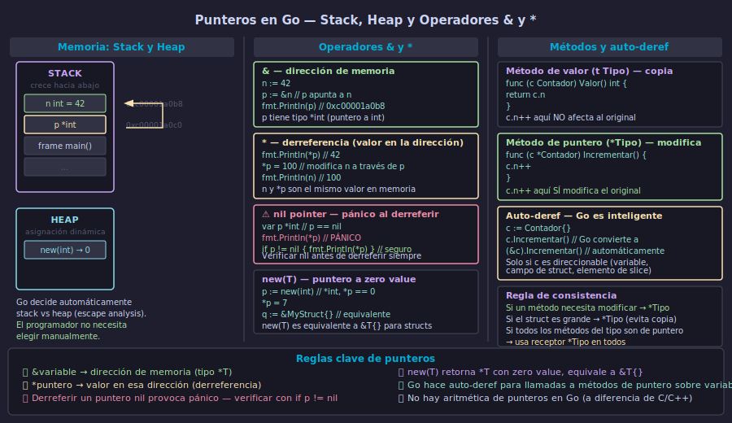

# Punteros en Go — Operadores `&`, `*` y `new()`



## 🎯 Objetivos

- Declarar punteros con `&` y derreferir con `*`
- Entender la relación entre una variable y el puntero que apunta a ella
- Identificar y evitar el nil pointer dereference
- Usar `new(T)` para crear punteros a valores en zero value

---

## 1. Qué es un puntero

Un **puntero** es una variable que almacena la dirección de memoria de otra variable. En lugar de contener un valor directamente (como hace un `int` o un `string`), contiene la ubicación donde ese valor vive.

En Go, los tipos de puntero se escriben con un asterisco antes del tipo base:

- `*int` — puntero a int
- `*string` — puntero a string
- `*Empleado` — puntero a struct Empleado

```go
n := 42          // n es de tipo int, vive en alguna dirección, ej: 0xc00001a0b8
p := &n          // p es de tipo *int, su valor ES esa dirección: 0xc00001a0b8

fmt.Println(n)   // 42        — el valor de n
fmt.Println(p)   // 0xc00001a0b8 — la dirección que almacena p
fmt.Println(*p)  // 42        — el valor EN la dirección apuntada por p
```

La dirección exacta (`0xc00001a0b8`) varía en cada ejecución. Lo importante es que `p` y `&n` siempre apuntan al mismo lugar donde vive `n`.

---

## 2. Operador `&` — obtener la dirección

El operador `&` (ampersand) aplicado a una variable retorna su dirección de memoria:

```go
x := 100
y := "hola"

px := &x  // *int
py := &y  // *string

fmt.Printf("tipo de px: %T\n", px) // *int
fmt.Printf("tipo de py: %T\n", py) // *string
```

Solo se puede obtener la dirección de variables **direccionables**: variables locales, campos de struct, elementos de slice. No se puede obtener la dirección de literales: `&42` no compila.

---

## 3. Operador `*` — derreferencia

El operador `*` (asterisco) aplicado a un puntero accede al valor almacenado en la dirección que apunta. También permite modificar ese valor:

```go
n := 42
p := &n

// Leer el valor
fmt.Println(*p)  // 42

// Modificar el valor a través del puntero
*p = 100
fmt.Println(n)   // 100 — n cambió porque p apunta a n
fmt.Println(*p)  // 100 — son el mismo valor

// p y n ahora son dos formas de acceder al mismo dato
*p++
fmt.Println(n)   // 101
```

La clave conceptual: `n` y `*p` **son la misma celda de memoria**. Modificar uno es modificar el otro.

---

## 4. Puntero nil — el valor cero de los punteros

El zero value de cualquier tipo puntero es `nil`. Un puntero nil no apunta a ninguna dirección. Intentar derreferir un puntero nil produce un **pánico en tiempo de ejecución** (runtime panic), no un error de compilación:

```go
var p *int  // p == nil, su zero value

fmt.Println(p)   // <nil>
fmt.Println(p == nil) // true

// Derreferir nil → PÁNICO
// fmt.Println(*p) // panic: runtime error: invalid memory address or nil pointer dereference
```

La defensa es siempre verificar antes de derreferir:

```go
func imprimir(p *int) {
    if p == nil {
        fmt.Println("puntero nil, no hay valor")
        return
    }
    fmt.Println("valor:", *p)
}
```

---

## 5. `new(T)` — crear un puntero a zero value

La función builtin `new(T)` asigna memoria para un valor de tipo `T`, inicializada en zero value, y retorna un puntero a ella:

```go
p := new(int)        // *int, *p == 0
fmt.Println(*p)      // 0
*p = 7
fmt.Println(*p)      // 7

ps := new(string)    // *string, *ps == ""
*ps = "hola"
fmt.Println(*ps)     // "hola"
```

Para structs, `new(T)` y `&T{}` son equivalentes:

```go
type Punto struct{ X, Y int }

p1 := new(Punto)     // *Punto, p1.X == 0, p1.Y == 0
p2 := &Punto{}       // equivalente — mismo resultado

p1.X = 3   // Go hace auto-deref: equivale a (*p1).X = 3
p2.Y = 4
```

En la práctica, `&T{}` se usa más porque permite inicializar campos en el mismo literal: `&Punto{X: 3, Y: 4}`.

---

## ✅ Checklist de verificación

- [ ] ¿Entiendo que `&x` retorna la dirección de `x` y que `*p` accede al valor en esa dirección?
- [ ] ¿Sé que modificar `*p` modifica también la variable original a la que apunta?
- [ ] ¿Verifico siempre `if p != nil` antes de derreferir un puntero que podría ser nil?
- [ ] ¿Entiendo que el zero value de cualquier tipo puntero es `nil`?
- [ ] ¿Puedo usar `new(T)` y entender que es equivalente a `&T{}`?

## 📚 Recursos adicionales

- [A Tour of Go — Pointers](https://go.dev/tour/moretypes/1)
- [Go Specification — Address operators](https://go.dev/ref/spec#Address_operators)
- [Go by Example — Pointers](https://gobyexample.com/pointers)
- [Effective Go — Allocation with new](https://go.dev/doc/effective_go#allocation_new)
