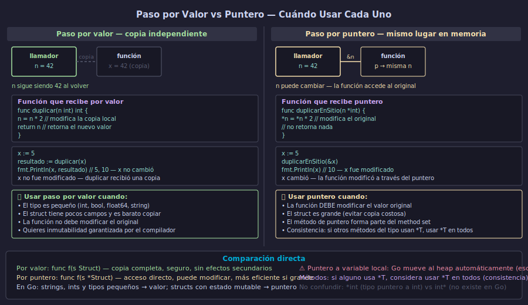

# Paso por Valor vs Puntero — Cuándo Usar Cada Uno



## 🎯 Objetivos

- Distinguir el comportamiento de funciones que reciben por valor vs por puntero
- Implementar métodos de puntero `(t *Tipo)` que modifican el receptor original
- Aplicar la regla de consistencia en el method set de un tipo
- Identificar cuándo Go aplica auto-deref automáticamente

---

## 1. Paso por valor — la función recibe una copia

Cuando pasas una variable a una función **por valor**, Go crea una copia completa. La función trabaja sobre esa copia. El original no puede ser modificado desde la función.

```go
func incrementar(n int) {
    n++  // modifica la copia local, no el original
    fmt.Println("dentro:", n) // 6
}

x := 5
incrementar(x)
fmt.Println("fuera:", x) // 5 — x no cambió
```

Esto aplica a todos los tipos de valor: `int`, `float64`, `bool`, `string`, arrays y **structs**. Cuando pasas un struct por valor, se copia campo a campo.

```go
type Punto struct{ X, Y int }

func mover(p Punto) {
    p.X += 10  // solo afecta la copia
}

pt := Punto{X: 1, Y: 2}
mover(pt)
fmt.Println(pt.X) // 1 — no cambió
```

---

## 2. Paso por puntero — la función accede al original

Cuando pasas un puntero, la función recibe la dirección del original. A través de la derreferencia puede modificar el valor original:

```go
func incrementar(n *int) {
    *n++  // modifica el valor original
}

x := 5
incrementar(&x)
fmt.Println(x) // 6 — sí cambió

// Mismo patrón con struct
func mover(p *Punto) {
    p.X += 10  // Go aplica auto-deref: (*p).X += 10
}

pt := Punto{X: 1, Y: 2}
mover(&pt)
fmt.Println(pt.X) // 11 — sí cambió
```

Dentro de la función, al acceder a campos con punto (`p.X`), Go desreferencia automáticamente el puntero. No necesitas escribir `(*p).X`.

---

## 3. Métodos de valor vs métodos de puntero

La diferencia entre método de valor y método de puntero es exactamente la misma que entre paso por valor y paso por puntero:

```go
type Contador struct {
    n int
}

// Método de valor — trabaja sobre una copia
func (c Contador) Valor() int {
    return c.n
}

// Método de puntero — trabaja sobre el original
func (c *Contador) Incrementar() {
    c.n++
}

func (c *Contador) Resetear() {
    c.n = 0
}
```

Demostración de la diferencia:

```go
c := Contador{}

c.Incrementar()   // c.n == 1
c.Incrementar()   // c.n == 2
c.Incrementar()   // c.n == 3

fmt.Println(c.Valor()) // 3

c.Resetear()
fmt.Println(c.Valor()) // 0
```

---

## 4. Auto-deref — Go convierte automáticamente

Cuando tienes una **variable** (no un valor temporal) y llamas un método de puntero sobre ella, Go aplica auto-deref: convierte `c.Metodo()` en `(&c).Metodo()`:

```go
c := Contador{} // c es una variable direccionable

c.Incrementar()   // Go convierte: (&c).Incrementar() — funciona
(&c).Incrementar() // equivalente explícito — también funciona
```

Esto solo funciona cuando la variable es **direccionable**. Los valores temporales no lo son:

```go
// Esto NO compila — el retorno de función es temporal, no direccionable
// ObtenerContador().Incrementar() // error si Incrementar tiene receptor *Contador

// Esto sí compila
ct := ObtenerContador()
ct.Incrementar() // ct es una variable, es direccionable
```

---

## 5. Reglas para elegir receptor

Aplicar estas reglas en orden:

1. **Si el método necesita modificar el receptor** → siempre `*T`
2. **Si el struct es grande** → `*T` para evitar copias costosas
3. **Si otros métodos del tipo usan `*T`** → usa `*T` en todos por consistencia

```go
// ✅ Todos los métodos de Archivo usan *T — consistente
type Archivo struct {
    nombre  string
    abierto bool
    datos   []byte // campo grande
}

func (a *Archivo) Abrir() error  { a.abierto = true; return nil }
func (a *Archivo) Cerrar()       { a.abierto = false }
func (a *Archivo) Nombre() string { return a.nombre } // solo lee, pero usa *T por consistencia
```

El razonamiento: si una interfaz requiere un método de puntero, el tipo solo la satisface con `*T`, no con `T`. Mezclar receptores de valor y puntero en el mismo tipo puede causar confusión con interfaces.

---

## ✅ Checklist de verificación

- [ ] ¿Sé que pasar un struct por valor crea una copia y que la función no puede modificar el original?
- [ ] ¿Puedo pasar `&variable` a una función para que modifique el original?
- [ ] ¿Implemento métodos de puntero `(t *Tipo)` cuando necesito modificar el receptor?
- [ ] ¿Entiendo que Go hace auto-deref al llamar métodos de puntero sobre variables direccionables?
- [ ] ¿Aplico la regla de consistencia: si algún método usa `*T`, los demás también?

## 📚 Recursos adicionales

- [Effective Go — Pointers vs Values](https://go.dev/doc/effective_go#pointers_vs_values)
- [Go FAQ — Should I define methods on values or pointers?](https://go.dev/doc/faq#methods_on_values_or_pointers)
- [A Tour of Go — Methods continued](https://go.dev/tour/methods/6)
- [Go by Example — Methods](https://gobyexample.com/methods)
