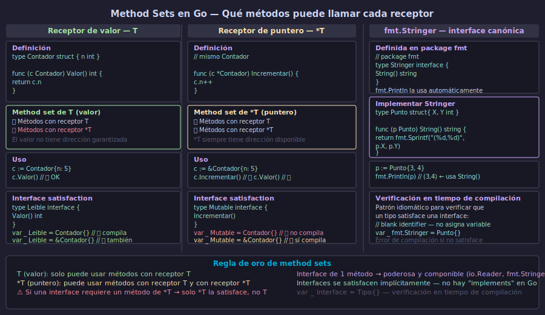

# Métodos en Go — Method Sets y `fmt.Stringer`



## 🎯 Objetivos

- Definir métodos sobre cualquier tipo declarado en el paquete
- Entender el **method set** de `T` vs `*T` y su impacto en interfaces
- Implementar `fmt.Stringer` para representación textual personalizada
- Verificar en tiempo de compilación que un tipo satisface una interface

---

## 1. Métodos en Go — qué son y cómo se definen

Un **método** es una función con un receptor: un parámetro especial que aparece entre `func` y el nombre del método. Go permite adjuntar métodos a cualquier tipo declarado en el mismo paquete, no solo structs.

```go
// Método sobre un struct
type Rectangulo struct {
    ancho, alto float64
}

func (r Rectangulo) Area() float64 {
    return r.ancho * r.alto
}

func (r Rectangulo) Perimetro() float64 {
    return 2 * (r.ancho + r.alto)
}

// Uso
rect := Rectangulo{ancho: 5, alto: 3}
fmt.Println(rect.Area())      // 15
fmt.Println(rect.Perimetro()) // 16
```

También se pueden definir métodos sobre tipos no-struct (alias de tipos básicos):

```go
type Celsius float64

func (c Celsius) String() string {
    return fmt.Sprintf("%.1f°C", float64(c))
}

t := Celsius(36.6)
fmt.Println(t) // 36.6°C — usa String() automáticamente
```

---

## 2. Método set de `T` vs `*T`

El **method set** de un tipo define qué métodos puede llamar. Esta regla tiene impacto directo en la satisfacción de interfaces:

| Tipo | Method set |
|------|-----------|
| `T` (valor) | Solo métodos con receptor `T` |
| `*T` (puntero) | Métodos con receptor `T` **y** métodos con receptor `*T` |

```go
type Pila struct {
    items []int
}

// Receptor de valor — no modifica, safe para leer
func (p Pila) Tope() int {
    if len(p.items) == 0 {
        return 0
    }
    return p.items[len(p.items)-1]
}

// Receptor de puntero — modifica la pila original
func (p *Pila) Apilar(n int) {
    p.items = append(p.items, n)
}

pila := Pila{}
pila.Apilar(1) // Go convierte a (&pila).Apilar(1)
pila.Apilar(2)
fmt.Println(pila.Tope()) // 2
```

La consecuencia práctica: si necesitas que una variable de tipo `T` satisfaga una interface que requiere un método de `*T`, debes usar `*T`, no `T`.

---

## 3. `fmt.Stringer` — la interface más usada de Go

`fmt.Stringer` es la interface que `fmt.Println`, `fmt.Printf("%v")` y similares buscan automáticamente para obtener la representación textual de un valor:

```go
// Definida en el paquete fmt:
// type Stringer interface {
//     String() string
// }

type Punto struct {
    X, Y int
}

func (p Punto) String() string {
    return fmt.Sprintf("(%d, %d)", p.X, p.Y)
}

p := Punto{X: 3, Y: 4}
fmt.Println(p)         // (3, 4) — usa String()
fmt.Printf("%v\n", p)  // (3, 4) — también
fmt.Printf("%s\n", p)  // (3, 4) — también
```

Sin `String()`, `fmt.Println(p)` mostraría `{3 4}`. Con `String()`, tienes control total de la representación.

---

## 4. Verificación en tiempo de compilación

El patrón idiomático para verificar que un tipo satisface una interface **en tiempo de compilación** (no en runtime):

```go
// Si Punto no implementa fmt.Stringer, esto falla al compilar
var _ fmt.Stringer = Punto{}    // si String() tiene receptor T
var _ fmt.Stringer = &Punto{}   // si String() tiene receptor *T

// Mismo patrón para interfaces propias
type Describer interface {
    Describir() string
}

var _ Describer = Punto{} // falla si Punto no tiene Describir() string
```

El `_` (blank identifier) descarta la variable asignada — solo se usa para forzar la verificación del compilador.

---

## 5. Métodos sobre tipos definidos por el usuario

Go permite agregar métodos a cualquier tipo que declares, incluyendo tipos basados en tipos básicos:

```go
type Kilogramos float64
type Libras float64

func (k Kilogramos) ALibras() Libras {
    return Libras(k * 2.20462)
}

func (k Kilogramos) String() string {
    return fmt.Sprintf("%.2fkg", float64(k))
}

peso := Kilogramos(70)
fmt.Println(peso)           // 70.00kg
fmt.Println(peso.ALibras()) // 154.3234
```

No se pueden definir métodos sobre tipos de otros paquetes. Por ejemplo, no puedes agregar métodos a `int` directamente — debes crear un tipo nuevo: `type MiInt int`.

---

## ✅ Checklist de verificación

- [ ] ¿Entiendo que el method set de `T` solo incluye métodos con receptor `T`, mientras que `*T` incluye ambos?
- [ ] ¿Puedo definir métodos sobre tipos no-struct (alias de tipos básicos)?
- [ ] ¿Implemento `String() string` para obtener representación textual con `fmt.Println`?
- [ ] ¿Uso `var _ Interface = Tipo{}` para verificar satisfacción de interface en compilación?
- [ ] ¿Sé que no puedo agregar métodos a tipos de otros paquetes?

## 📚 Recursos adicionales

- [A Tour of Go — Methods](https://go.dev/tour/methods/1)
- [Effective Go — Methods](https://go.dev/doc/effective_go#methods)
- [pkg.go.dev — fmt.Stringer](https://pkg.go.dev/fmt#Stringer)
- [Go by Example — Methods](https://gobyexample.com/methods)
