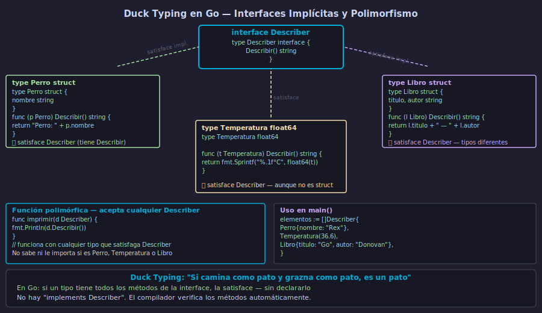

# Interfaces Implícitas en Go — Duck Typing, `any` e `error`



## 🎯 Objetivos

- Declarar interfaces con uno o más métodos
- Entender que Go usa satisfacción implícita (sin `implements`)
- Escribir funciones polimórficas que acepten cualquier tipo que satisfaga la interface
- Usar `any` (`interface{}`) y entender sus limitaciones
- Comprender la interface `error` y cómo implementarla

---

## 1. Declaración de interfaces

Una interface en Go define un conjunto de firmas de métodos. Cualquier tipo que tenga esos métodos la satisface automáticamente:

```go
// Declarar una interface
type Geometria interface {
    Area() float64
    Perimetro() float64
}

// Declarar dos tipos distintos
type Circulo struct {
    radio float64
}

type Rectangulo struct {
    ancho, alto float64
}
```

Ninguno de estos tipos declara "yo implemento Geometria". Lo que importa es que tengan los métodos requeridos.

---

## 2. Implementación implícita — duck typing

Implementar una interface en Go significa simplemente tener los métodos con las firmas correctas:

```go
import "math"

// Circulo satisface Geometria
func (c Circulo) Area() float64 {
    return math.Pi * c.radio * c.radio
}

func (c Circulo) Perimetro() float64 {
    return 2 * math.Pi * c.radio
}

// Rectangulo satisface Geometria
func (r Rectangulo) Area() float64 {
    return r.ancho * r.alto
}

func (r Rectangulo) Perimetro() float64 {
    return 2 * (r.ancho + r.alto)
}
```

Ningún `implements`. El compilador verifica los métodos automáticamente. Si falta alguno, el error aparece cuando intentas asignar o pasar el tipo donde se espera la interface.

---

## 3. Polimorfismo con interfaces

Las interfaces permiten escribir funciones que operan sobre cualquier tipo que las satisfaga:

```go
func imprimirGeometria(g Geometria) {
    fmt.Printf("Área: %.2f\n", g.Area())
    fmt.Printf("Perímetro: %.2f\n", g.Perimetro())
}

func main() {
    c := Circulo{radio: 5}
    r := Rectangulo{ancho: 4, alto: 6}

    imprimirGeometria(c) // Área: 78.54 / Perímetro: 31.42
    imprimirGeometria(r) // Área: 24.00 / Perímetro: 20.00

    // Slice de interface — almacena tipos distintos
    formas := []Geometria{c, r, Circulo{radio: 2}}
    for _, f := range formas {
        fmt.Println(f.Area())
    }
}
```

La función `imprimirGeometria` no sabe ni necesita saber si recibe un `Circulo` o un `Rectangulo`. Solo le importa que el tipo tenga `Area()` y `Perimetro()`.

---

## 4. `any` — la interface vacía

`any` es un alias de `interface{}` (introducido en Go 1.18). Representa el tipo que satisfacen **todos los tipos** en Go, porque no requiere ningún método:

```go
var x any

x = 42
fmt.Println(x) // 42

x = "hola"
fmt.Println(x) // hola

x = []int{1, 2, 3}
fmt.Println(x) // [1 2 3]
```

La limitación: cuando tienes un `any`, no puedes llamar métodos específicos del tipo concreto sin hacer una **type assertion** primero:

```go
var v any = "hola"

// Esto NO compila — any no tiene método ToUpper
// v.ToUpper()

// Necesitas type assertion para recuperar el tipo concreto
s, ok := v.(string)
if ok {
    fmt.Println(strings.ToUpper(s)) // HOLA
}
```

Usa `any` solo cuando genuinamente necesitas almacenar valores de tipo desconocido. Prefiere siempre interfaces concretas.

---

## 5. La interface `error`

`error` es la interface más importante de la librería estándar de Go:

```go
// Definida en el paquete builtin:
// type error interface {
//     Error() string
// }
```

Cualquier tipo que tenga un método `Error() string` satisface la interface `error`. Esto permite crear errores personalizados:

```go
// Error personalizado con contexto adicional
type ErrorValidacion struct {
    Campo   string
    Mensaje string
}

func (e *ErrorValidacion) Error() string {
    return fmt.Sprintf("validación fallida en '%s': %s", e.Campo, e.Mensaje)
}

// Uso — retorna la interface error, no el tipo concreto
func validarEdad(edad int) error {
    if edad < 0 {
        return &ErrorValidacion{Campo: "edad", Mensaje: "no puede ser negativa"}
    }
    if edad > 150 {
        return &ErrorValidacion{Campo: "edad", Mensaje: "valor irreal"}
    }
    return nil
}

err := validarEdad(-5)
if err != nil {
    fmt.Println(err) // validación fallida en 'edad': no puede ser negativa
}
```

Retornar la interface `error` (no el tipo concreto) es el patrón idiomático en Go.

---

## ✅ Checklist de verificación

- [ ] ¿Entiendo que en Go no existe `implements` — la satisfacción es implícita por los métodos?
- [ ] ¿Puedo declarar una interface y hacer que varios tipos la satisfagan sin modificarlos?
- [ ] ¿Escribo funciones que aceptan interfaces para lograr polimorfismo?
- [ ] ¿Entiendo que `any` acepta todo pero limita las operaciones disponibles sin type assertion?
- [ ] ¿Sé implementar la interface `error` con un struct personalizado?

## 📚 Recursos adicionales

- [A Tour of Go — Interfaces](https://go.dev/tour/methods/9)
- [Effective Go — Interfaces](https://go.dev/doc/effective_go#interfaces)
- [Go blog — Error handling and Go](https://go.dev/blog/error-handling-and-go)
- [Go by Example — Interfaces](https://gobyexample.com/interfaces)
- [Go Proverbs — "The bigger the interface, the weaker the abstraction"](https://go-proverbs.github.io/)
